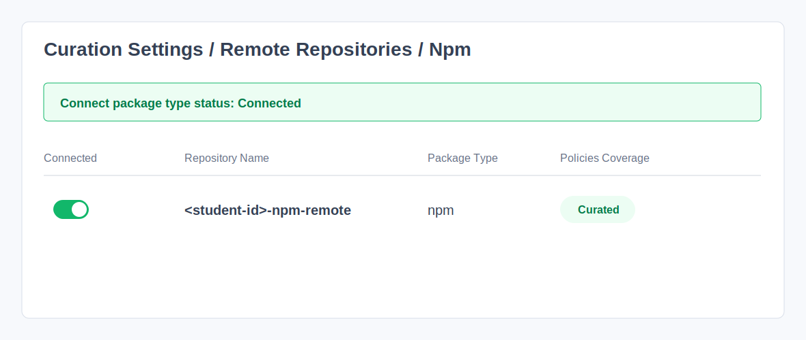
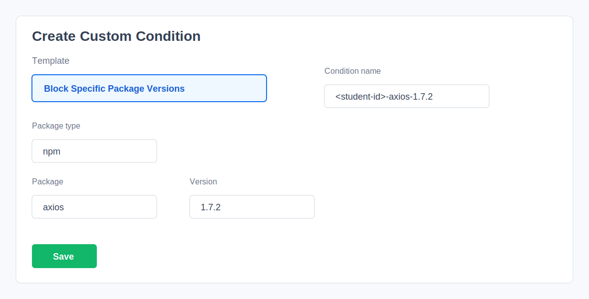
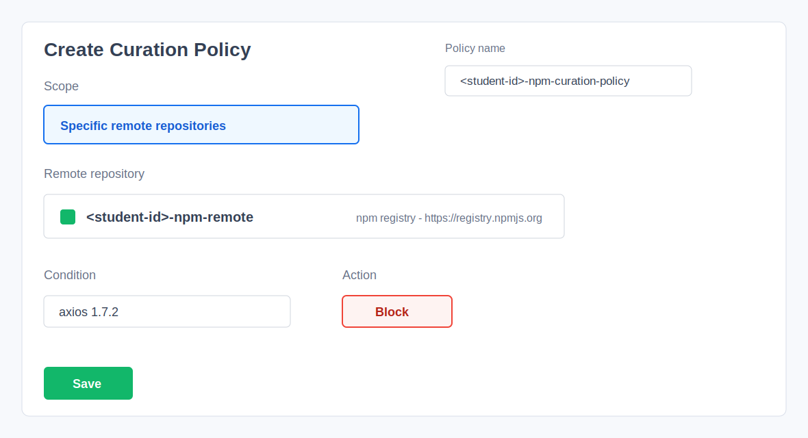
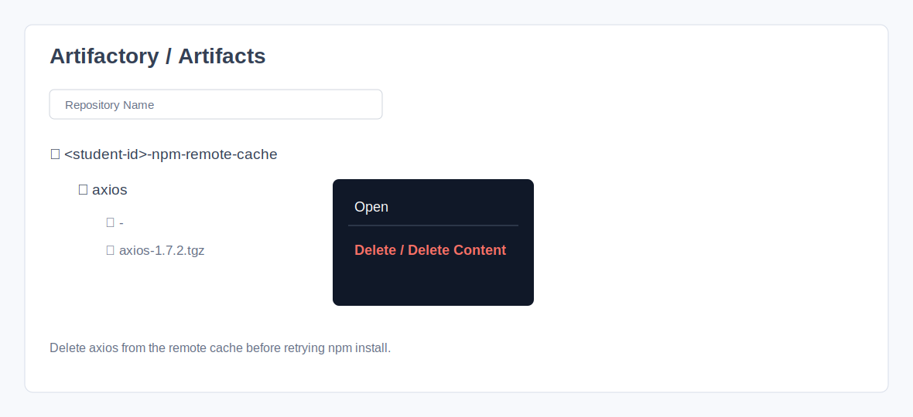
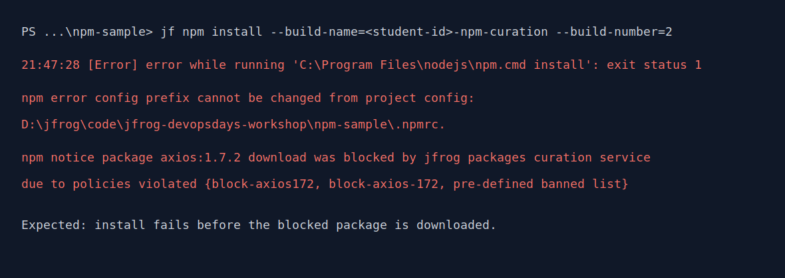
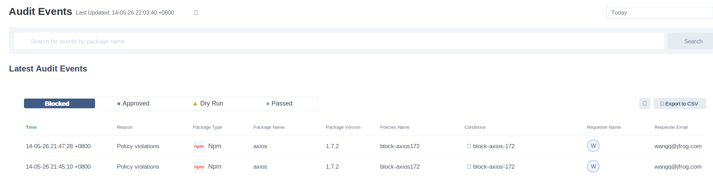

# NPM + Curation Workshop Guide (Customer)

Goal: Complete an **npm build + build-info publication** on a customer machine, and demonstrate how **JFrog Curation blocks the download of a simulated malicious version, `axios@1.7.2`**.

---

## 0. Prerequisites

- JFrog Cloud trial account: `https://jfrog.com/start-free/`
- Required local tools:
  - JFrog CLI (`jf`)
  - Git (`git`)
  - Node.js 20.x LTS, including `npm`

### Installation

- **Install JFrog CLI**
  - Open `https://jfrog.com/getcli/`
  - Download and install the package for your operating system.

- **Install Node.js 20.x LTS**
  - Open `https://nodejs.org/` and install the **LTS 20.x** package.
  - **Windows note:** select “Add to PATH” during installation, then open a new PowerShell or CMD window before running `node -v`.
  - Optional for macOS with Homebrew:
    ```bash
    brew install node@20
    brew link --force --overwrite node@20
    ```

Verify the tools:

```bash
jf --version
git --version
node -v
npm -v
```

---

## 1. Log In To JFrog

Log in to your JFrog Platform instance and generate an Access Token first.

Official references:
- Access Tokens: `https://docs.jfrog.com/administration/docs/access-tokens`
- JFrog CLI Configuration: `https://docs.jfrog.com/integrations/docs/configuring-the-cli`

In the JFrog Platform UI:
1. Open your JFrog Platform URL, for example `https://<your-jfrog-domain>`.
2. Go to Administration -> Security -> Access Tokens.
3. Click Generate Token and create an Access Token for the current user.
4. Copy and store the token securely. It will be used by JFrog CLI.

Access Token page URL format:

```text
https://<your-jfrog-domain>/ui/admin/configuration/security/access_tokens
```

`<your-jfrog-domain>` is your JFrog Platform domain, for example `company.jfrog.io`.

Configure JFrog CLI with one command. The Server ID is fixed as `Artifactory`.

Windows PowerShell:

```powershell
$env:JFROG_URL = "https://<your-jfrog-domain>"
$env:JFROG_ACCESS_TOKEN = "<your-access-token>"

jf c add Artifactory --url=$env:JFROG_URL --access-token=$env:JFROG_ACCESS_TOKEN --interactive=false
```

macOS / Linux:

```bash
JFROG_URL="https://<your-jfrog-domain>"
JFROG_ACCESS_TOKEN="<your-access-token>"

jf c add Artifactory --url="$JFROG_URL" --access-token="$JFROG_ACCESS_TOKEN" --interactive=false
```

Verify the configuration:

```bash
jf c show
jf rt ping
```

All later commands use the Server ID `Artifactory`. If you see `Server ID 'Artifactory' does not exist`, the CLI configuration was not created successfully. Run the `jf c add Artifactory ...` command again.

---

## 2. Clone The Workshop Repository

```bash
cd ~
git clone https://github.com/alexwang66/jfrog-workshop.git
cd jfrog-workshop
```

---

## 3. Create The Workshop Repositories

Run the repository creation script from the automation directory.

Each student uses their English name as the `STUDENT_ID` prefix. This prevents multiple students from overwriting each other’s repositories, remote cache, build-info, or Curation policy.

Naming rules:
- Use lowercase English letters, numbers, and hyphens only.
- Use 3-20 characters.
- Do not use spaces, Chinese characters, or special characters.
- If names are duplicated, add a last name or number, for example `alex-wang` or `alex2`.

Example: if the student’s English name is Alex, use `alex`.

Windows PowerShell:

```powershell
cd ~/jfrog-workshop/automation
$env:STUDENT_ID = "alex"
.\create-repo.ps1 -StudentId $env:STUDENT_ID
```

If PowerShell blocks script execution, temporarily allow scripts in the current terminal and retry:

```powershell
Set-ExecutionPolicy -Scope Process -ExecutionPolicy Bypass
.\create-repo.ps1 -StudentId $env:STUDENT_ID
```

macOS / Linux:

```bash
cd ~/jfrog-workshop/automation
export STUDENT_ID="alex"
chmod +x ./create-repo.sh
./create-repo.sh "$STUDENT_ID" all
```

The scripts create these npm repositories:
- Resolve repository: `<student-id>-npm-virtual` (virtual)
- Remote repository: `<student-id>-npm-remote` (remote, pointing to npmjs)
- Deploy repository: `<student-id>-npm-dev-local` (local)
- QA repository: `<student-id>-npm-qa-local` (local)
- Prod repository: `<student-id>-npm-prod-local` (local)

To clean up one student’s repositories, run the delete script with the same `STUDENT_ID`:

Windows PowerShell:

```powershell
cd ~/jfrog-workshop/automation
$env:STUDENT_ID = "alex"
.\delete-repo.ps1 -StudentId $env:STUDENT_ID
```

macOS / Linux:

```bash
cd ~/jfrog-workshop/automation
export STUDENT_ID="alex"
./delete-repo.sh "$STUDENT_ID" all
```

---

## 4. NPM Build, Publish, And Build-Info

Enter the sample project directory.

Windows PowerShell:

```powershell
cd ~/jfrog-workshop/npm-sample
$env:STUDENT_ID = "alex"
Get-Content .\package.json
```

macOS / Linux:

```bash
cd ~/jfrog-workshop/npm-sample
export STUDENT_ID="alex"
cat ./package.json
```

All `npm` and `jf npm ...` commands must be executed from the `npm-sample` directory. Do not run them from the `automation` directory. The `automation` directory is only used to create JFrog repositories.

Configure npm resolution and deployment:

Windows PowerShell:

```powershell
jf npm-config `
  --server-id-resolve=Artifactory `
  --server-id-deploy=Artifactory `
  --repo-resolve="$($env:STUDENT_ID)-npm-virtual" `
  --repo-deploy="$($env:STUDENT_ID)-npm-dev-local" `
  --global=false
```

macOS / Linux:

```bash
jf npm-config \
  --server-id-resolve=Artifactory \
  --server-id-deploy=Artifactory \
  --repo-resolve="${STUDENT_ID}-npm-virtual" \
  --repo-deploy="${STUDENT_ID}-npm-dev-local" \
  --global=false
```

Clean the local install output, `package-lock.json`, and npm cache so dependencies are resolved through JFrog Artifactory again.

Windows PowerShell:

```powershell
Remove-Item -Recurse -Force node_modules, package-lock.json -ErrorAction SilentlyContinue
npm cache clean --force
Test-Path .\package-lock.json
```

`Test-Path .\package-lock.json` should return `False`, which means the lock file has been removed.

macOS / Linux:

```bash
rm -rf node_modules package-lock.json
npm cache clean --force
test ! -f ./package-lock.json && echo "package-lock.json removed"
```

Install, publish, and publish build-info:

Windows PowerShell:

```powershell
$env:BUILD_NAME = "$($env:STUDENT_ID)-npm-sample"
$env:BUILD_NUMBER = "1"

jf npm install --build-name=$env:BUILD_NAME --build-number=$env:BUILD_NUMBER
jf npm publish --build-name=$env:BUILD_NAME --build-number=$env:BUILD_NUMBER

jf rt build-add-git $env:BUILD_NAME $env:BUILD_NUMBER
jf rt build-collect-env $env:BUILD_NAME $env:BUILD_NUMBER
jf rt build-publish $env:BUILD_NAME $env:BUILD_NUMBER
```

macOS / Linux:

```bash
BUILD_NAME="${STUDENT_ID}-npm-sample"
BUILD_NUMBER=1

jf npm install --build-name="$BUILD_NAME" --build-number="$BUILD_NUMBER"
jf npm publish --build-name="$BUILD_NAME" --build-number="$BUILD_NUMBER"

jf rt build-add-git "$BUILD_NAME" "$BUILD_NUMBER"
jf rt build-collect-env "$BUILD_NAME" "$BUILD_NUMBER"
jf rt build-publish "$BUILD_NAME" "$BUILD_NUMBER"
```

Verify in the UI:
- Artifactory -> Builds -> `<student-id>-npm-sample` -> `#1`

---

## 5. Curation Demo: Block `axios@1.7.2`

This workshop **treats `axios@1.7.2` as a simulated malicious package version**. The goal is to make `npm install` fail when it tries to resolve that version through JFrog Curation.

### 5.1 Enable Curation For The Remote Repository

First, confirm that Curation is enabled for the student’s own remote repository. Otherwise, the policy will not affect download requests.

- Go to Administration -> Curation -> Remote Repositories, or a similar page depending on your UI version.
- Find `<student-id>-npm-remote` and ensure Curation is enabled.

Example:



UI labels may vary slightly by JFrog Platform version. Use the labels in your own instance as the source of truth.

### 5.2 Switch The Sample Project To The Blocked Version

To trigger the Curation block, directly edit `~/jfrog-workshop/npm-sample/package.json` and switch the sample project to the simulated risky package version used in this lab.

Windows PowerShell:

```powershell
cd ~/jfrog-workshop/npm-sample
notepad .\package.json
Get-Content .\package.json
```

macOS / Linux:

```bash
cd ~/jfrog-workshop/npm-sample
nano package.json
cat package.json
```

Confirm that `package.json` contains this content:

```json
{
  "dependencies": {
    "axios": "1.7.2"
  }
}
```

Then clean the project before reinstalling. `package-lock.json` must be deleted; otherwise npm may decide the dependency tree is already satisfied and the Curation block may not be observable.

Windows PowerShell:

```powershell
cd ~/jfrog-workshop/npm-sample
Remove-Item -Recurse -Force node_modules, package-lock.json -ErrorAction SilentlyContinue
npm cache clean --force
Test-Path .\package-lock.json
```

`Test-Path .\package-lock.json` should return `False`.

macOS / Linux:

```bash
cd ~/jfrog-workshop/npm-sample
rm -rf node_modules package-lock.json
npm cache clean --force
test ! -f ./package-lock.json && echo "package-lock.json removed"
```

### 5.3 Create A Curation Policy In The JFrog UI

Create a Custom Condition first, then use it in a Curation Policy.

#### 5.3.1 Create A Custom Condition

Official reference: `https://docs.jfrog.com/security/docs/create-custom-conditions`

In the JFrog UI:
- Go to Administration -> Curation Settings -> **Conditions**.
- Click **Create Condition**.
- Select the **Block Specific Package Versions** template.
- Configure:
  - Condition name: `<student-id>-axios-1.7.2`
  - Package type: `npm`
  - Package: `axios`
  - Version: `1.7.2`
- Save the condition.

Example:



#### 5.3.2 Create A Policy And Apply It To The NPM Remote Repository

In the JFrog UI:
- Go to Administration -> Curation -> **Policies Management**.
- Create a policy:
  - Policy name: `<student-id>-npm-curation-policy`
  - Scope: **Specific remote repositories** and select `<student-id>-npm-remote`.
  - Condition: select the custom condition for `axios 1.7.2`.
  - Action: **Block**.
- Save the policy.

Example:



### 5.4 Delete The Cached `axios` Package From Artifactory Remote Cache

If `axios@1.7.2` was downloaded before the Curation policy was created, Artifactory may have cached it in the remote cache repository. Delete the cached package before retrying the npm install.

Official references:
- Remote Repositories: `https://docs.jfrog.com/artifactory/docs/remote-repositories`
- Managing Artifacts: `https://docs.jfrog.com/artifactory/docs/managing-artifacts`

In the JFrog UI:
1. Go to Artifactory -> Artifacts.
2. Open the remote cache repository: `<student-id>-npm-remote-cache`.
3. Find `axios`.
4. Right-click `axios` and choose Delete / Delete Content.
5. Confirm the deletion.

Example:



### 5.5 Re-run Install And Observe The Block

Windows PowerShell:

```powershell
cd ~/jfrog-workshop/npm-sample
$env:STUDENT_ID = "alex"
Remove-Item -Recurse -Force node_modules, package-lock.json -ErrorAction SilentlyContinue
npm cache clean --force

$env:BUILD_NAME = "$($env:STUDENT_ID)-npm-sample"
$env:BUILD_NUMBER = "2"

jf npm install --build-name=$env:BUILD_NAME --build-number=$env:BUILD_NUMBER
jf rt build-add-git $env:BUILD_NAME $env:BUILD_NUMBER
jf rt build-collect-env $env:BUILD_NAME $env:BUILD_NUMBER
jf rt build-publish $env:BUILD_NAME $env:BUILD_NUMBER
```

macOS / Linux:

```bash
cd ~/jfrog-workshop/npm-sample
export STUDENT_ID="alex"
rm -rf node_modules package-lock.json
npm cache clean --force

BUILD_NAME="${STUDENT_ID}-npm-sample"
BUILD_NUMBER=2

jf npm install --build-name="$BUILD_NAME" --build-number="$BUILD_NUMBER"
jf rt build-add-git "$BUILD_NAME" "$BUILD_NUMBER"
jf rt build-collect-env "$BUILD_NAME" "$BUILD_NUMBER"
jf rt build-publish "$BUILD_NAME" "$BUILD_NUMBER"
```

Expected result:
- CLI output shows that a package version was blocked, specifically `axios@1.7.2`.
- Installation fails or is replaced by an allowed version, depending on the policy action and configuration.
- If install succeeds, build-info is available at Builds -> `<student-id>-npm-sample` -> `#2`.

Example blocked CLI output:

```text
21:47:28 [Error] error while running 'C:\Program Files\nodejs\npm.cmd install': exit status 1
npm error config prefix cannot be changed from project config: D:\jfrog\code\jfrog-devopsdays-workshop\npm-sample\.npmrc.
npm notice package axios:1.7.2 download was blocked by jfrog packages curation service due to the following policies violated {block-axios172,block-axios-172,This package version is part of a pre-defined banned list.}
```



If the output is similar to `added 28 packages`, npm installed the dependencies successfully and Curation did not block this download. Check:
- The policy is saved and enabled.
- The policy action is **Block**, not Dry Run or audit-only.
- The policy scope includes `<student-id>-npm-remote`.
- Administration -> Curation -> Remote Repositories shows `<student-id>-npm-remote` as Connected / Curated.
- `<student-id>-npm-remote` has Xray indexing enabled. The official On-Demand Curation documentation recommends confirming both Curation and Xray indexing for the remote repository.
- The custom condition exactly matches Package type `npm`, Package `axios`, Version `1.7.2`.
- Local `node_modules` and `package-lock.json` were deleted, and `npm cache clean --force` was run.
- Artifactory -> Artifacts -> `<student-id>-npm-remote-cache` no longer contains `axios`.
- Curation audit/events show this download attempt. If no event is shown, the repository is usually not handled by Curation. If the event says No Policy Violation, the policy condition, scope, or action usually did not match.

Curation audit event example:



### 5.6 Find An Approved Version In Catalog And Rebuild

After confirming the block, go back to JFrog Catalog, find the latest `axios` version, and verify that it is allowed for download.

Official references:
- Catalog: `https://docs.jfrog.com/security/docs/catalog`
- Use npm with JFrog CLI: `https://docs.jfrog.com/artifactory/docs/use-npm-with-jfrog-cli`

In the JFrog UI:
1. Go to Catalog -> Explore.
2. Search for `axios`.
3. Select the latest version, `1.16.1`.
4. Confirm that the page shows **Approved for downloading**.

Example:


Then directly edit `package.json` to remediate the project to the approved version and update the package version.

Windows PowerShell:

```powershell
cd ~/jfrog-workshop/npm-sample
$env:STUDENT_ID = "alex"

notepad .\package.json
Get-Content .\package.json
```

macOS / Linux:

```bash
cd ~/jfrog-workshop/npm-sample
export STUDENT_ID="alex"

nano package.json
cat package.json
```

Confirm that `package.json` contains at least this content:

```json
{
  "version": "1.0.4",
  "dependencies": {
    "axios": "1.16.1"
  }
}
```

Clean the local npm state, rebuild, and publish build-info.

Windows PowerShell:

```powershell
cd ~/jfrog-workshop/npm-sample
$env:STUDENT_ID = "alex"

Remove-Item -Recurse -Force node_modules, package-lock.json -ErrorAction SilentlyContinue
npm cache clean --force

$env:BUILD_NAME = "$($env:STUDENT_ID)-npm-sample"
$env:BUILD_NUMBER = "3"

jf npm install --build-name=$env:BUILD_NAME --build-number=$env:BUILD_NUMBER
jf rt build-add-git $env:BUILD_NAME $env:BUILD_NUMBER
jf rt build-collect-env $env:BUILD_NAME $env:BUILD_NUMBER
jf rt build-publish $env:BUILD_NAME $env:BUILD_NUMBER
```

macOS / Linux:

```bash
cd ~/jfrog-workshop/npm-sample
export STUDENT_ID="alex"

rm -rf node_modules package-lock.json
npm cache clean --force

BUILD_NAME="${STUDENT_ID}-npm-sample"
BUILD_NUMBER=3

jf npm install --build-name="$BUILD_NAME" --build-number="$BUILD_NUMBER"
jf rt build-add-git "$BUILD_NAME" "$BUILD_NUMBER"
jf rt build-collect-env "$BUILD_NAME" "$BUILD_NUMBER"
jf rt build-publish "$BUILD_NAME" "$BUILD_NUMBER"
```

Verify in the UI:
- Artifactory -> Builds -> `<student-id>-npm-sample` -> `#3`
- The build-info dependencies should show `axios@1.16.1`.
