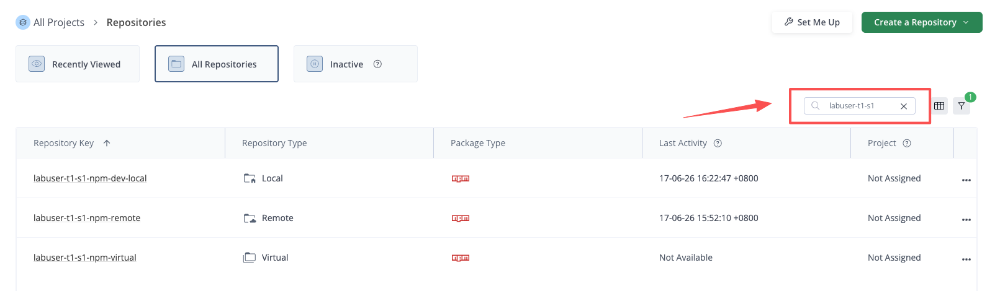
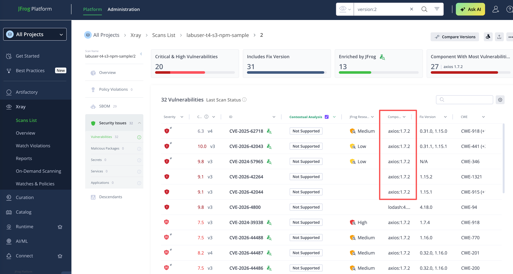
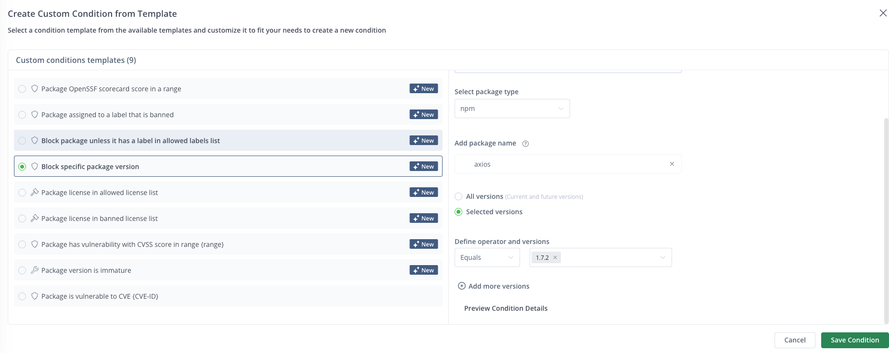

# NPM + Curation 工作坊指南（客戶版）

目標：在客戶本機完成一次 **npm 建置 + 發布 build-info**，並示範 **JFrog Curation 阻擋模擬惡意版本 `axios@1.7.2` 的下載**。

## 本工作坊流程

0. **前置需求** — 安裝並驗證 `jf`、`git`、`node`、`npm`
1. **登入 JFrog** — 找到實驗帳號、登入平台、產生 Access Token、設定 JFrog CLI
2. **複製工作坊 Repository** — 把範例專案 clone 到本機
3. **建立工作坊 Repository** — 用腳本建立你專屬的一組 npm 倉庫
4. **NPM 建置、發布與 Build-Info** — 首次建置並推送 build-info（`#1`）
5. **Curation 示範** — 引入模擬惡意版本 `axios@1.7.2`、用 Curation 阻擋、再換回安全版本

---

## 0. 前置需求

開始動手前，先確認本機已裝好並能執行以下工具。

- 本機需安裝：
  - VS Code 或 Cursor（建議，用於開啟專案與執行內建終端機）
  - JFrog CLI（`jf`）
  - Git（`git`）
  - Node.js 20.x LTS，包含 `npm`

### 安裝

- **安裝 JFrog CLI**
  - 開啟 `https://jfrog.com/getcli/`
  - 依照作業系統下載並安裝對應套件。
- **安裝 Node.js 20.x LTS**
  - 開啟 `https://nodejs.org/`，安裝 **LTS 20.x** 版本。
  - **Windows 注意事項：** 安裝時建議勾選 “Add to PATH”，安裝完成後重新開啟 PowerShell 或 CMD，再執行 `node -v`。
  - macOS 搭配 Homebrew 可選用：
    ```bash
    brew install node@20
    brew link --force --overwrite node@20
    ```

驗證工具：

```bash
jf --version
git --version
node -v
npm -v
```

> ✅ 檢查點：四條 `--version` 指令都能印出版本號，代表工具已就緒。

---

## 1. 登入 JFrog

工具就緒後，接著登入平台：先用你的**實驗帳號**登入 JFrog Platform UI，再在 UI 產生 Access Token，最後用它設定 JFrog CLI。

### 1.1 找到並登入你的實驗帳號

本次活動每位學員都有一個依**座位**編出來的實驗帳號。

**座位圖：**


- 講台屏幕在前方，講師台在右前角。
- 桌子分兩種：**藍色細桌 = 2 人桌（S1–S2）**；**寬桌 = 4 人桌（S1–S4）**。
- 每張桌上的小方塊就是座位，上面的數字就是你的**座位號**。

**三步找到你的帳號：**

| 步驟 | 動作 |
|:---:|---|
| **1** | 在座位圖上找到你的**桌號** `T1` – `T20` |
| **2** | 看桌上標牌確認你的**座位號** `S1` / `S2` …（2 人桌只有 S1、S2） |
| **3** | 組合出帳號：**`labuser-t〈桌號〉-s〈座位號〉`** |

> **範例：** 坐在 **4 號桌、3 號座** → 帳號為 `labuser-t4-s3`。

**登入資訊：**

| 項目 | 內容 |
|---|---|
| **平台網址** | `https://<your-jfrog-domain>` |
| **帳號 Username** | `labuser-t〈桌號〉-s〈座位號〉` |
| **密碼 Password** | `***REDACTED***`（所有人統一） |

登入步驟：

1. 用瀏覽器打開平台網址 `https://<your-jfrog-domain>`。
2. 在登入頁輸入你的**帳號**與**統一密碼** `***REDACTED***`（以講師現場公布為準）。
3. 點擊 **Log In** 進入 JFrog 平台。

> ⚠️ **請勿修改密碼**，以免後續登入或講師協助時對不上。
>
> 登不進去？1) 確認帳號全小寫、桌號/座位號沒填錯；2) 確認密碼是 `***REDACTED***`；3) 仍無法登入請**舉手聯絡講師**。

### 1.2 產生 Access Token 並設定 CLI

登入平台後，接著讓 JFrog CLI 連上你的 JFrog Platform 實例：先在 UI 產生 Access Token，再用它設定 CLI。

在 JFrog Platform UI 中產生 Access Token：

1. 從左側導覽進入：**Administration → User Management → Access Tokens**。
2. 點擊 **Generate Token**。
3. 在彈出視窗中**直接點擊 Generate 產生**，不需要任何額外設定。
4. 複製並妥善保存產生的 token。
5. 將 token 寫入下方終端機的環境變數 `JFROG_ACCESS_TOKEN`，供 JFrog CLI 使用。

使用一條命令設定 JFrog CLI。Server ID 固定為 `Artifactory`。

 Windows PowerShell：

```powershell
$env:JFROG_URL = "https://<your-jfrog-domain>"
$env:JFROG_ACCESS_TOKEN = "<your-access-token>"

jf c add Artifactory --url=$env:JFROG_URL --access-token=$env:JFROG_ACCESS_TOKEN --interactive=false
jf c use Artifactory
```

🐧 macOS / Linux：

```bash
JFROG_URL="https://<your-jfrog-domain>"
JFROG_ACCESS_TOKEN="<your-access-token>"

jf c add Artifactory --url="$JFROG_URL" --access-token="$JFROG_ACCESS_TOKEN" --interactive=false
jf c use Artifactory
```

驗證設定：

```bash

jf c show
jf rt ping
```

後續所有命令都使用 Server ID `Artifactory`。如果看到 `Server ID 'Artifactory' does not exist`，代表 CLI 設定沒有成功建立，請重新執行 `jf c add Artifactory ...`。

> ✅ 檢查點：`jf rt ping` 回傳 `OK`，且 `jf c show` 能看到 `Artifactory` 這個 server。

---

## 2. 複製工作坊 Repository

CLI 連上平台後，把工作坊範例專案 clone 到本機。

```bash
cd ~
# 若 ~/jfrog-workshop 已存在（例如先前已 clone 過），可略過 git clone 直接進入
git clone https://github.com/alexwang66/jfrog-workshop.git 2>/dev/null || echo "jfrog-workshop 已存在，略過 clone"
cd ~/jfrog-workshop
```

> ✅ 檢查點：`~/jfrog-workshop` 目錄已存在，裡面有 `npm-sample/` 與 `automation/`。
>
> ℹ️ 後續步驟的 `cd` 指令都使用 **絕對路徑**（如 `cd ~/jfrog-workshop/automation`），所以不論你目前在哪個目錄，直接複製貼上都不會出錯，**不需要**再手動 `cd jfrog-workshop`。

---

## 3. 建立工作坊 Repository

專案 clone 完成後，用 `automation` 目錄的腳本，在 Artifactory 建立你專屬的一組 npm 倉庫。

每位學員請使用**自己的 user id**（登入帳號）作為 `STUDENT_ID`，這個值會作為 repository 前綴，避免多人共用 lab 時互相覆蓋。

範例：如果你的 user id 是 `labuser-t4-s3`，請將 `STUDENT_ID` 設為 `labuser-t4-s3`，然後執行下面的建立腳本。

 Windows PowerShell：

```powershell
cd ~/jfrog-workshop/automation
$env:STUDENT_ID = "labuser-t4-s3"
.\create-repo.ps1 -StudentId $env:STUDENT_ID
```

如果 PowerShell 執行原則阻擋腳本，可在目前終端機暫時允許腳本後重試：

```powershell
Set-ExecutionPolicy -Scope Process -ExecutionPolicy Bypass
.\create-repo.ps1 -StudentId $env:STUDENT_ID
```

🐧 macOS / Linux：

```bash
cd ~/jfrog-workshop/automation
export STUDENT_ID="labuser-t4-s3"
chmod +x ./create-repo.sh
./create-repo.sh "$STUDENT_ID" all
```

腳本會建立以下 npm repositories：

- Resolve repository：`<student-id>-npm-virtual`（virtual）
- Remote repository：`<student-id>-npm-remote`（remote，指向 npmjs）
- Deploy repository：`<student-id>-npm-dev-local`（local）

在 Artifactory 中開啟：`https://<your-jfrog-domain>/ui/admin/repositories`，查看剛建立的倉庫。
選擇「All Repositories」，在右側搜尋欄輸入你的 student-id 進行搜尋。



> ✅ 檢查點：在 All Repositories 中能搜到 3 個以你的 student-id 為前綴的倉庫（`-npm-virtual` / `-npm-remote` / `-npm-dev-local`）。

---

## 4. NPM 建置、發布與 Build-Info

倉庫就緒後，在本機完成第一次 npm 建置，並把 build-info 推送到 Artifactory。

本工作坊 **將 `axios@1.7.2` 視為模擬惡意套件版本**。目標是讓 `npm install` 透過 JFrog Curation 解析到該版本時被阻擋。

進入範例專案目錄。

 Windows PowerShell：

```powershell
cd ~/jfrog-workshop/npm-sample
$env:STUDENT_ID = "labuser-t4-s3"
Get-Content .\package.json
```

🐧 macOS / Linux：

```bash
cd ~/jfrog-workshop/npm-sample
export STUDENT_ID="labuser-t4-s3"
cat ./package.json
```

所有 `npm` 與 `jf npm ...` 命令都必須在 `npm-sample` 目錄中執行。不要在 `automation` 目錄中執行這些命令；`automation` 只用於建立 JFrog repositories。

設定 npm 解析與部署：

 Windows PowerShell：

```powershell
jf npm-config `
  --server-id-resolve=Artifactory `
  --server-id-deploy=Artifactory `
  --repo-resolve="$($env:STUDENT_ID)-npm-virtual" `
  --repo-deploy="$($env:STUDENT_ID)-npm-dev-local" `
  --global=false
```

🐧 macOS / Linux：

```bash
jf npm-config \
  --server-id-resolve=Artifactory \
  --server-id-deploy=Artifactory \
  --repo-resolve="${STUDENT_ID}-npm-virtual" \
  --repo-deploy="${STUDENT_ID}-npm-dev-local" \
  --global=false
```
- 查看 package.json里的"axios"的版本"1.7.2"
 Windows PowerShell：

```powershell
cd ~/jfrog-workshop/npm-sample
notepad .\package.json
Get-Content .\package.json
```

🐧 macOS / Linux：

```bash
cd ~/jfrog-workshop/npm-sample
cat package.json
```

確認 `package.json` 中存在以下內容：

```json
{
  "dependencies": {
    "axios": "1.7.2"
  }
}
```

安裝、發布套件並發布 build-info：

 Windows PowerShell：

```powershell
$env:BUILD_NAME = "$($env:STUDENT_ID)-npm-sample"
$env:BUILD_NUMBER = "1"

jf npm install --build-name=$env:BUILD_NAME --build-number=$env:BUILD_NUMBER
jf npm publish --build-name=$env:BUILD_NAME --build-number=$env:BUILD_NUMBER

jf rt build-add-git $env:BUILD_NAME $env:BUILD_NUMBER
jf rt build-collect-env $env:BUILD_NAME $env:BUILD_NUMBER
jf rt build-publish $env:BUILD_NAME $env:BUILD_NUMBER
```

🐧 macOS / Linux：

```bash
BUILD_NAME="${STUDENT_ID}-npm-sample"
BUILD_NUMBER=1

jf npm install --build-name="$BUILD_NAME" --build-number="$BUILD_NUMBER"
jf npm publish --build-name="$BUILD_NAME" --build-number="$BUILD_NUMBER"

jf rt build-add-git "$BUILD_NAME" "$BUILD_NUMBER"
jf rt build-collect-env "$BUILD_NAME" "$BUILD_NUMBER"
jf rt build-publish "$BUILD_NAME" "$BUILD_NUMBER"
```

在 UI 中驗證：

- Artifactory -> Builds -> `<student-id>-npm-sample` -> `#1`



> ✅ 檢查點：Builds 中出現 `#1`，build-info 的 dependencies 含 `axios@1.7.2`。

---

## 5. Curation 示範：阻擋 `axios@1.7.2`

首次 build-info 完成後，進入本工作坊的重點：建立 Curation Policy 和 Condition，用 Curation 在下載源頭把 `axios@1.7.2` 擋下，最後再換回安全版本重新建置。

### 5.1  建立 Curation Policy 來阻斷 axios@1.7.2

> ⚠️ 多人共用同一個平台時，Policy 與 Condition 的名稱皆不可重複。請在 Policy 名稱與 Condition 名稱都帶上你自己的 student-id（例如 `block-axios-1.7.2-<student-id>`）。

- Step 1， Platform -> Curation -> Policiies

- Step 2


- Step 3, 新建 Condition
  **Conditions**。
- 點擊 **Create Condition**。
  
- 選擇 **Block Specific Package Versions** 範本。
- 設定：
  - Condition name：`block-axios-1.7.2-<student-id>`（請帶上你自己的 student-id，避免多人共用平台時名稱衝突）
  - Package type：`npm`
  - Package：`axios`
  - Version：`1.7.2`
- 儲存 condition。




- Step 4, Click Next
- Step 5, Select "Block" and Save the Policy
  


### 5.2 從 Artifactory Remote Cache 刪除已快取的 `axios`

如果 `axios@1.7.2` 在建立 Curation policy 前已被下載，Artifactory 可能已將它快取到 remote cache repository。重新安裝前需先刪除該快取套件。

在 JFrog UI 中：

1. 進入 Artifactory -> Artifacts。
2. 開啟 remote cache repository：`<student-id>-npm-remote-cache`。
3. 找到 `axios`。
4. 右鍵點擊 `axios`，選擇 Delete / Delete Content。
5. 確認刪除。

示例：


### 5.3 重新執行 Install 並觀察阻擋

 Windows PowerShell：

```powershell
cd ~/jfrog-workshop/npm-sample
$env:STUDENT_ID = "labuser-t4-s3"
Remove-Item -Recurse -Force node_modules, package-lock.json -ErrorAction SilentlyContinue
npm cache clean --force

$env:BUILD_NAME = "$($env:STUDENT_ID)-npm-sample"
$env:BUILD_NUMBER = "2"

jf npm install --build-name=$env:BUILD_NAME --build-number=$env:BUILD_NUMBER
```

🐧 macOS / Linux：

```bash
cd ~/jfrog-workshop/npm-sample
export STUDENT_ID="labuser-t4-s3"
rm -rf node_modules package-lock.json
npm cache clean --force

BUILD_NAME="${STUDENT_ID}-npm-sample"
BUILD_NUMBER=2

jf npm install --build-name="$BUILD_NAME" --build-number="$BUILD_NUMBER"
```

預期結果：

- CLI 輸出顯示某個套件版本被阻擋，具體為 `axios@1.7.2`。
- 安裝失敗，或依 policy action 與設定被替換為允許版本。
CLI 被阻擋輸出示例：


如果輸出類似 `added 28 packages`，表示 npm 已成功安裝依賴，Curation 沒有阻擋本次下載。請檢查：

- Policy 是否已儲存並啟用。
- Policy action 是否為 **Block**，而不是 Dry Run 或僅 audit。
- Policy scope 是否包含 `<student-id>-npm-remote`。
- Administration -> Curation -> Remote Repositories 是否顯示 `<student-id>-npm-remote` 為 Connected / Curated。
- `<student-id>-npm-remote` 是否已啟用 Xray indexing。官方 On-Demand Curation 文件建議同時確認 remote repository 已啟用 Curation 與 Xray indexing。
- Custom condition 是否精確匹配 Package type `npm`、Package `axios`、Version `1.7.2`。
- 本機 `node_modules` 與 `package-lock.json` 是否已刪除，並已執行 `npm cache clean --force`。
- Artifactory -> Artifacts -> `<student-id>-npm-remote-cache` 中是否已不再包含 `axios`。
- Curation audit/events 是否出現本次下載事件。若沒有事件，通常表示該 repository 尚未由 Curation 接管。若事件顯示 No Policy Violation，通常表示 policy condition、scope 或 action 未匹配。

Curation audit event 示例：


### 5.4 在 Catalog 中選擇可用版本並重新構建

阻擋效果確認後，回到 JFrog Catalog 查找 `axios` 的最新版本，確認該版本是否可下載。

在 JFrog UI 中：

1. 進入 Catalog -> Explore。
2. 搜尋 `axios`。
3. 選擇最新版本 `1.16.1`。
4. 確認頁面顯示 **Approved for downloading**。

示例：


接著直接修改 `package.json`，將axios專案修復到1.16.1版本。

 Windows PowerShell：

```powershell
cd ~/jfrog-workshop/npm-sample
$env:STUDENT_ID = "labuser-t4-s3"

notepad .\package.json
Get-Content .\package.json
```

🐧 macOS / Linux：

```bash
cd ~/jfrog-workshop/npm-sample
export STUDENT_ID="labuser-t4-s3"

cat package.json
```

確認 `package.json` 中至少包含以下內容：

```json
{
  "version": "1.0.4",
  "dependencies": {
    "axios": "1.16.1"
  }
}
```

清理本機 npm 狀態後重新構建並上傳 build-info。

 Windows PowerShell：

```powershell
cd ~/jfrog-workshop/npm-sample
$env:STUDENT_ID = "labuser-t4-s3"

Remove-Item -Recurse -Force node_modules, package-lock.json -ErrorAction SilentlyContinue
npm cache clean --force

$env:BUILD_NAME = "$($env:STUDENT_ID)-npm-sample"
$env:BUILD_NUMBER = "3"

jf npm install --build-name=$env:BUILD_NAME --build-number=$env:BUILD_NUMBER
jf npm publish --build-name=$env:BUILD_NAME --build-number=$env:BUILD_NUMBER
jf rt build-add-git $env:BUILD_NAME $env:BUILD_NUMBER
jf rt build-collect-env $env:BUILD_NAME $env:BUILD_NUMBER
jf rt build-publish $env:BUILD_NAME $env:BUILD_NUMBER
```

🐧 macOS / Linux：

```bash
cd ~/jfrog-workshop/npm-sample
export STUDENT_ID="labuser-t4-s3"

rm -rf node_modules package-lock.json
npm cache clean --force

BUILD_NAME="${STUDENT_ID}-npm-sample"
BUILD_NUMBER=3

jf npm install --build-name="$BUILD_NAME" --build-number="$BUILD_NUMBER"
jf npm publish --build-name="$BUILD_NAME" --build-number="$BUILD_NUMBER"
jf rt build-add-git "$BUILD_NAME" "$BUILD_NUMBER"
jf rt build-collect-env "$BUILD_NAME" "$BUILD_NUMBER"
jf rt build-publish "$BUILD_NAME" "$BUILD_NUMBER"
```

在 UI 中驗證：

- Artifactory -> Builds -> `<student-id>-npm-sample` -> `#3`
- Build-info 中的 dependencies 應顯示已使用 `axios@1.16.1`。

> ✅ 檢查點：`#2` 已觸發 Curation 阻擋（或在 Xray 看到 `axios 1.7.2` 的漏洞），`#3` 已改用 `axios@1.16.1` 並建置成功，Curation 流程完成。

---

## 附錄：清理倉庫

如需清理某位學員的 repository，使用相同的 `STUDENT_ID` 執行刪除腳本：

 Windows PowerShell：

```powershell
cd ~/jfrog-workshop/automation
$env:STUDENT_ID = "labuser-t4-s3"
.\delete-repo.ps1 -StudentId $env:STUDENT_ID
```

🐧 macOS / Linux：

```bash
cd ~/jfrog-workshop/automation
export STUDENT_ID="labuser-t4-s3"
chmod +x ./delete-repo.sh
./delete-repo.sh "$STUDENT_ID" all
```

> 說明：`delete-repo.sh ... all` 除了刪除 3 個 npm 倉庫，也會一併刪除本工作坊的 build-info（`<student-id>-npm-sample`）。


官方參考文件：

- Catalog：`https://docs.jfrog.com/security/docs/catalog`
- Use npm with JFrog CLI：`https://docs.jfrog.com/artifactory/docs/use-npm-with-jfrog-cli`
