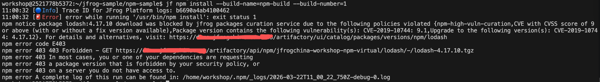
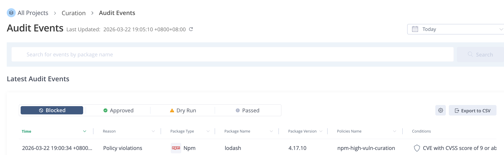

# NPM + Curation Workshop Guide (Customer)

目标：在客户本机完成一次 **npm 构建 + 发布 build-info**，并演示 **JFrog Curation 阻断“恶意版本” axios** 的下载。

---

## 0) 你需要准备

- JFrog Cloud 试用账号：`https://jfrog.com/start-free/`
- 本机已安装（最少 3 个工具）：
  - JFrog CLI（`jf`）
  - Git（`git`）
  - Node.js 20.x LTS（含 `npm`）

### 安装

- **安装 JFrog CLI**
  - 打开：`https://jfrog.com/getcli/`
  - 按页面选择你的 OS 下载/安装

- **安装 Node.js 20.x LTS（含 npm）**
  - 打开：`https://nodejs.org/`，选择 **LTS（20.x）** 安装包
  - **Windows 提示**：安装向导建议勾选 “Add to PATH”（安装后重新打开一个新的 PowerShell/CMD 再执行 `node -v`）
  - （macOS + Homebrew 可选）
    ```bash
    brew install node@20
    brew link --force --overwrite node@20
    ```

验证：

```bash
jf --version
git --version
node -v
npm -v
```

---

## 1) 登录 JFrog

先登录 JFrog trial 平台并获取 Access Token。

参考官方文档：
- Access Tokens：`https://docs.jfrog.com/administration/docs/access-tokens`
- JFrog CLI Configuration：`https://docs.jfrog.com/integrations/docs/configuring-the-cli`

在 JFrog Platform UI 中：
1. 打开你的 JFrog trial 地址，例如：`https://<your-company>.jfrog.io`
2. 进入 Administration → User Management → Access Tokens
3. 创建一个当前用户可用的 Access Token
4. 复制 token 并妥善保存，后续 CLI 登录会用到

示例界面：


然后用一条命令配置 JFrog CLI。Server ID 固定为 `Artifactory`。

Windows PowerShell：

```powershell
$env:JFROG_URL = "https://<your-company>.jfrog.io"
$env:JFROG_ACCESS_TOKEN = "<your-access-token>"

jf c add Artifactory --url=$env:JFROG_URL --access-token=$env:JFROG_ACCESS_TOKEN --interactive=false
```

macOS / Linux：

```bash
JFROG_URL="https://<your-company>.jfrog.io"
JFROG_ACCESS_TOKEN="<your-access-token>"

jf c add Artifactory --url="$JFROG_URL" --access-token="$JFROG_ACCESS_TOKEN" --interactive=false
```

验证：

```bash
jf c show
jf rt ping
```

后续命令统一使用 Server ID：`Artifactory`。如果看到 `Server ID 'Artifactory' does not exist`，说明登录步骤没有成功创建 `Artifactory` 这个配置名，请重新执行上面的 `jf c add Artifactory ...` 命令。

---

## 2) 拉取 workshop 代码

```bash
cd ~
git clone https://github.com/alexwang66/jfrog-workshop.git
cd jfrog-workshop
```

---

## 3) 一键创建 workshop 仓库（推荐）

在本项目自带脚本目录执行：

Windows PowerShell：

```powershell
cd ~/jfrog-workshop/automation
.\create-repo.ps1
```

如果 PowerShell 执行策略阻止脚本运行，可在当前终端临时放开后重试：

```powershell
Set-ExecutionPolicy -Scope Process -ExecutionPolicy Bypass
.\create-repo.ps1
```

macOS / Linux：

```bash
cd ~/jfrog-workshop/automation
chmod +x ./create-repo.sh
./create-repo.sh all
```

脚本默认会创建（示例）：
- resolve：`workshop-npm-virtual`（virtual）
- remote：`workshop-npm-remote`（remote，指向 npmjs）
- deploy：`workshop-npm-dev-local`（local）

---

## 4) NPM：通过 Artifactory 安装、发布包、发布 build-info

进入示例目录。

Windows PowerShell：

```powershell
cd ~/jfrog-workshop/npm-sample
Get-Content .\package.json
```

macOS / Linux：

```bash
cd ~/jfrog-workshop/npm-sample
cat ./package.json
```

后续所有 `npm` 和 `jf npm ...` 命令都必须在 `npm-sample` 目录执行。不要在 `automation` 目录执行这些命令；`automation` 只用于创建 JFrog 仓库。

配置 npm 解析/部署到你刚创建的仓库：

Windows PowerShell：

```powershell
jf npm-config `
  --server-id-resolve=Artifactory `
  --server-id-deploy=Artifactory `
  --repo-resolve=workshop-npm-virtual `
  --repo-deploy=workshop-npm-dev-local `
  --global=false
```

macOS / Linux：

```bash
jf npm-config \
  --server-id-resolve=Artifactory \
  --server-id-deploy=Artifactory \
  --repo-resolve=workshop-npm-virtual \
  --repo-deploy=workshop-npm-dev-local \
  --global=false
```

清理本地安装结果、`package-lock.json` 和 npm 缓存，确保依赖重新通过 JFrog Artifactory 解析：

Windows PowerShell：

```powershell
Remove-Item -Recurse -Force node_modules, package-lock.json -ErrorAction SilentlyContinue
npm cache clean --force
Test-Path .\package-lock.json
```

`Test-Path .\package-lock.json` 输出 `False` 表示 lock 文件已删除。

macOS / Linux：

```bash
rm -rf node_modules package-lock.json
npm cache clean --force
test ! -f ./package-lock.json && echo "package-lock.json removed"
```

执行安装/发布，并发布 build-info：

Windows PowerShell：

```powershell
$env:BUILD_NAME = "npm-sample"
$env:BUILD_NUMBER = "1"

jf npm install --build-name=$env:BUILD_NAME --build-number=$env:BUILD_NUMBER
jf npm publish --build-name=$env:BUILD_NAME --build-number=$env:BUILD_NUMBER

jf rt build-add-git $env:BUILD_NAME $env:BUILD_NUMBER
jf rt build-collect-env $env:BUILD_NAME $env:BUILD_NUMBER
jf rt build-publish $env:BUILD_NAME $env:BUILD_NUMBER
```

macOS / Linux：

```bash
BUILD_NAME=npm-sample
BUILD_NUMBER=1

jf npm install --build-name="$BUILD_NAME" --build-number="$BUILD_NUMBER"
jf npm publish --build-name="$BUILD_NAME" --build-number="$BUILD_NUMBER"

jf rt build-add-git "$BUILD_NAME" "$BUILD_NUMBER"
jf rt build-collect-env "$BUILD_NAME" "$BUILD_NUMBER"
jf rt build-publish "$BUILD_NAME" "$BUILD_NUMBER"
```

在 UI 查看：
- Artifactory → Builds → `npm-sample` → `#1`

---

## 5) Curation 演示：把 `axios@1.7.2` 当作“恶意版本”并阻断下载

本 workshop **假设**：`axios@1.7.2` 是恶意版本，目标是让 `npm install` 在解析到该版本时被 Curation 阻断。

### 5.1 确保项目依赖了这个版本

在 `~/jfrog-workshop/npm-sample/package.json` 确保有这一行（若不同请修改）：

- `"axios": "1.7.2"`

然后清理并准备重新安装。这里必须删除 `package-lock.json`，否则 npm 可能直接按 lock 文件判断依赖已满足，Curation 阻断不容易被观察到：

Windows PowerShell：

```powershell
cd ~/jfrog-workshop/npm-sample
Remove-Item -Recurse -Force node_modules, package-lock.json -ErrorAction SilentlyContinue
npm cache clean --force
Test-Path .\package-lock.json
```

`Test-Path .\package-lock.json` 输出 `False` 表示 lock 文件已删除。

macOS / Linux：

```bash
cd ~/jfrog-workshop/npm-sample
rm -rf node_modules package-lock.json
npm cache clean --force
test ! -f ./package-lock.json && echo "package-lock.json removed"
```

### 5.2 在 JFrog UI 创建 Curation Policy（阻断 axios@1.7.2）

这里需要 **先创建 Custom Condition**，再用它创建 Policy。

#### 5.2.1 创建 Custom Condition（customer condition）

参考官方文档：`https://docs.jfrog.com/security/docs/create-custom-conditions`

在 JFrog UI：
- Administration → Curation Settings → **Conditions**
- 右上角 **Create Condition**
- 选择模板：**Block Specific Package Versions**
- 配置：
  - Package type：`npm`
  - Package：`axios`
  - Version：`1.7.2`
- Save

示例界面：


#### 5.2.2 创建 Policy 并应用到 npm remote

在 JFrog UI：
- Administration → Curation → **Policies Management**
- Create Policy：
  - Scope：选择 **Specific remote repositories**（选 `workshop-npm-remote`）
  - Condition：选择刚创建的 custom condition（axios 1.7.2）
  - Action：**Block**
- Save

选择 remote repository 的示例界面：


选择 Block action 的示例界面：


确保 Curation 对该 remote 生效（UI 入口因版本略有不同）：
- Administration → Curation → Remote Repositories（或类似页面）
- 找到 `workshop-npm-remote`，确保启用 Curation

示例界面：


> UI 入口名称可能随版本略有不同，以你实例的实际菜单为准。

### 5.3 清理 Artifactory remote cache 中已缓存的 axios

如果 `axios@1.7.2` 在创建 Curation Policy 之前已经被下载过，Artifactory 可能已经把它缓存到了 remote cache。需要先删除这个缓存，再重新执行本地 npm 清理和安装。

参考官方文档：
- Remote Repositories：`https://docs.jfrog.com/artifactory/docs/remote-repositories`
- Managing Artifacts：`https://docs.jfrog.com/artifactory/docs/managing-artifacts`

在 JFrog UI：
1. 进入 Artifactory → Artifacts
2. 找到 remote cache 仓库：`workshop-npm-remote-cache`
3. 在该仓库中找到 `axios`
4. 右键 `axios`，选择 Delete / Delete Content
5. 确认删除


### 5.4 重新执行 install，观察被阻断

Windows PowerShell：

```powershell
cd ~/jfrog-workshop/npm-sample
Remove-Item -Recurse -Force node_modules, package-lock.json -ErrorAction SilentlyContinue
npm cache clean --force

$env:BUILD_NAME = "npm-curation"
$env:BUILD_NUMBER = "2"

jf npm install --build-name=$env:BUILD_NAME --build-number=$env:BUILD_NUMBER
jf rt build-add-git $env:BUILD_NAME $env:BUILD_NUMBER
jf rt build-collect-env $env:BUILD_NAME $env:BUILD_NUMBER
jf rt build-publish $env:BUILD_NAME $env:BUILD_NUMBER
```

macOS / Linux：

```bash
cd ~/jfrog-workshop/npm-sample
rm -rf node_modules package-lock.json
npm cache clean --force

BUILD_NAME=npm-curation
BUILD_NUMBER=2

jf npm install --build-name="$BUILD_NAME" --build-number="$BUILD_NUMBER"
jf rt build-add-git "$BUILD_NAME" "$BUILD_NUMBER"
jf rt build-collect-env "$BUILD_NAME" "$BUILD_NUMBER"
jf rt build-publish "$BUILD_NAME" "$BUILD_NUMBER"
```

期望现象：
- CLI 输出显示某个依赖版本被阻断（axios@1.7.2）
- 安装失败或被替换为允许版本（取决于你 policy 的动作与配置）
- 如果 install 成功，Builds 中可以查看 `npm-curation` → `#2` 的 build-info

CLI 被阻断的示例输出：



如果输出类似 `added 28 packages`，说明 npm 已经成功安装依赖，Curation 没有阻断本次下载。请检查：
- Policy 是否已经保存并启用
- Policy action 是否是 **Block**，而不是 Dry Run / Audit-only
- Policy scope 是否选中了 `workshop-npm-remote`
- Administration → Curation → Remote Repositories 中，`workshop-npm-remote` 是否是 Connected / Curated 状态
- `workshop-npm-remote` 是否启用了 Xray indexing；官方 On-Demand Curation 文档建议同时确认 remote repository 已启用 Curation 和 Xray indexing
- Custom Condition 是否准确配置为 Package type：`npm`，Package：`axios`，Version：`1.7.2`
- 本地是否已经删除 `node_modules`、`package-lock.json` 并执行 `npm cache clean --force`
- Artifactory → Artifacts → `workshop-npm-remote-cache` 中的 `axios` 是否已经删除；删除后刷新页面确认 `axios` 不再存在
- Curation 的 audit/event 页面是否出现本次下载事件。如果没有事件，通常说明 repository 没有被 Curation 接管；如果事件结果是 No Policy Violation，通常说明 policy condition/scope/action 没有匹配

Curation audit event 示例：


