<div align="center">



<br/>

[](https://jfrogpz.github.io/jfrog-workshop/)
[](https://jfrogpz.github.io/jfrog-workshop/)
[](https://jfrogpz.github.io/jfrog-workshop/)
[](./README.md)
[](./LICENSE)

**[← 中文版](./README.md)**

</div>

---

This Workshop has the following features:

- **Ready out of the box**: Built on GitHub Codespace — no local tool installation required, just click to enter a unified cloud development environment
- **AI-guided learning**: Supports GitHub Copilot Chat and Claude Code — the AI assistant guides you through every step, no prior JFrog knowledge needed
- **Self-study mode**: Start anytime without an instructor — work at your own pace with the AI assistant by your side
- **Competitive mode**: Fun guaranteed, complete tasks to earn points in real time, with the instructor projecting a live leaderboard
- **Freely extensible**: Guide an AI to add new learning modules in one shot — customize tasks and auto-verify completion conditions

---

## `// WORKSHOP_INFO`

### Module Catalog

👉 **[Browse all modules and learning resources](https://jfrogpz.github.io/jfrog-workshop/)**

Filter by scenario, role, or ecosystem — and see the full task list and duration for each module.

### Duration
Approximately 60 minutes per module

### Competitive Mode Rules

Tasks are organized into **modules** (e.g. `npm-basic`, `npm-security`). Each module has its own task list with individual point values. The instructor chooses which modules are active for the event.

- Complete tasks within the active module(s) to earn points
- Ties are broken by the time the last task was completed (earlier is better)
- Task details and commands are provided by the AI assistant during the session

### Prize
> To be announced by the instructor on the day 🎁

---

## `// QUICK_START`

### Step 1: Open in GitHub Codespace

Click the button below to launch the cloud development environment instantly (no local tool installation needed):

[](https://codespaces.new/jfrogpz/jfrog-workshop)

> ⏱️ First-time Codespace startup takes about 1–2 minutes — please be patient.
>
> 🆓 GitHub personal accounts get 60 free Codespace hours per month. This Workshop uses approximately 1 hour.
>
> 💻 **If Codespace is not available**, refer to [SETUP_EN.md](./guides/SETUP_EN.md) to set up the environment on your local machine.

### Step 2: Open AI Assistant

This Workshop supports two AI assistants — use whichever you have access to:

**Option 1: GitHub Copilot Chat (recommended, built into Codespace)**

Once Codespace is ready, the **GitHub Copilot Chat** panel is embedded on the **right side** of the window — type your message directly.

**Option 2: Claude Code (local environment)**

Clone the repo locally and open the project directory with [Claude Code](https://claude.ai/code). The `CLAUDE.md` file loads automatically, and Claude will act as your Workshop assistant with the same guided flow as Copilot Chat.

> 🤖 **If neither AI assistant is available**, read the module instructions file directly — e.g. [.github/instructions/npm-security.instructions-en.md](.github/instructions/npm-security.instructions-en.md) — it contains complete step-by-step instructions for all tasks.

### Step 3: Start the Workshop

Type one of the following in the AI assistant chat:

```
# Self-study mode (no instructor or EVENT_ID needed)
I want to self-study

# Event mode (joining an instructor-led session)
I want to start the workshop, my EVENT_ID is <ID provided by instructor>

# Switching modules mid-session
I want to switch to the npm-security module

# Switching modes mid-session (your progress is preserved)
I want to switch to event mode
```

The AI assistant will:
1. Guide you to log in to JFrog UI and generate your personal access token
2. Ask which module you want to learn
3. Walk you through each task step by step (check your progress, explain concepts, and help diagnose issues)

> 💡 **Tip**: All commands are provided by the AI assistant — just paste them into the terminal.
>
> 📊 **Leaderboard** (event mode only): The instructor will project the leaderboard, which refreshes every 30 seconds.

---

## `// ORGANIZER_GUIDE`

If you are an instructor or event organizer, please refer to:

👉 [ORGANIZER_EN.md](./guides/ORGANIZER_EN.md)

To add a new learning module to the workshop:

👉 [MODULE-AUTHOR_EN.md](./guides/MODULE-AUTHOR_EN.md)
