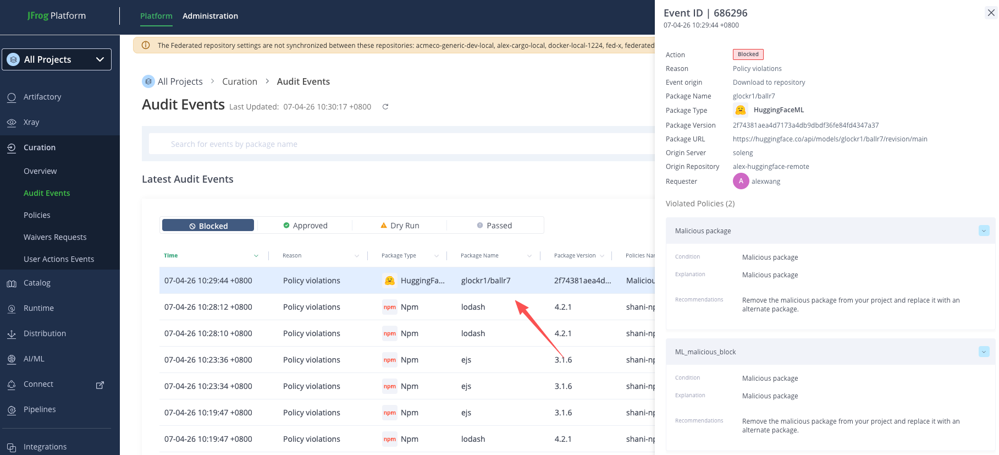

# Download a Hugging Face Model Snapshot using Python

This Python script downloads a snapshot of a Hugging Face model repository using the `huggingface_hub` library.

## 📦 Requirements

- Python 3.7+
- `huggingface_hub` package

Install the dependency:

```bash
pip install huggingface_hub
```

Import environment variables in the "Set me up"

```
export HF_HUB_ETAG_TIMEOUT=86400
export HF_HUB_DOWNLOAD_TIMEOUT=86400
export HF_ENDPOINT=https://acme.jfrog.io/artifactory/api/huggingfaceml/alex-huggingface-remote

export HF_TOKEN=your-artifactory-token
```

Run the download model command:

```
python download_model.py 
```

📁 Output
The model will be downloaded and cached locally under the ~/.cache/huggingface directory.

Malicious model block download:

Replace openai-community/gpt2 with any other model name you wish to download.

```
model_name = "glockr1/ballr7"  # Malicious model for testing.
```

Try rerun the download model command again.

```
python download_model.py 
```

📁 Output

```
huggingface_hub.errors.HfHubHTTPError: 403 Forbidden: None.
Cannot access content at: https://soleng.jfrog.io/artifactory/api/huggingfaceml/alex-huggingface-remote/api/models/glockr1/ballr7/revision/main.
Make sure your token has the correct permissions.
Forbidden: artifact is blocked
```

The output indicate that the model has been block by JFrog Curation.

Go to Curation -> Audit log for the details:


