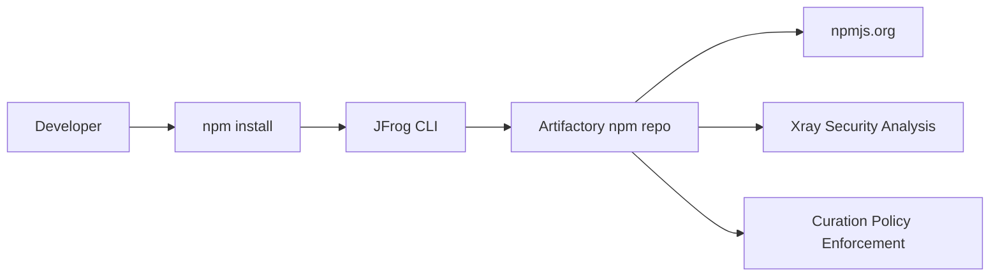
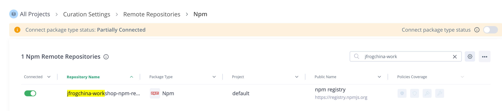
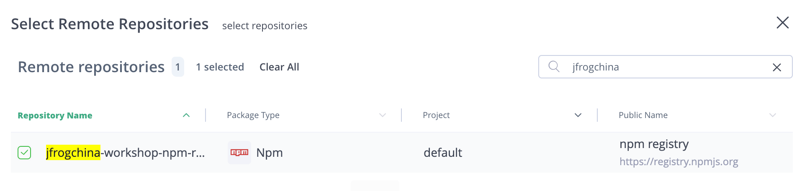
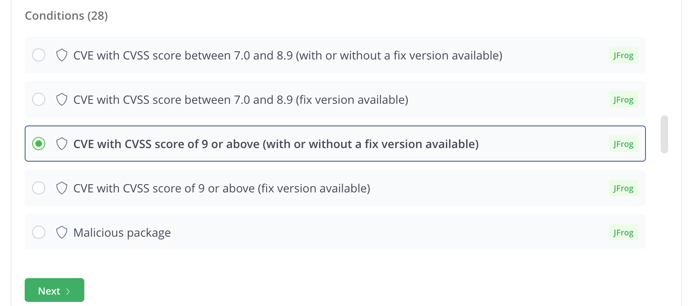
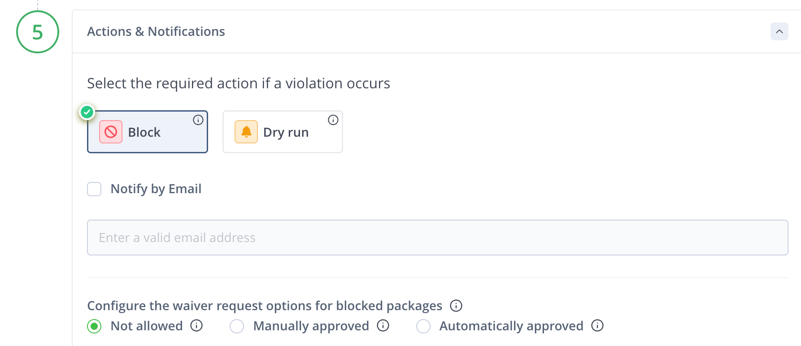
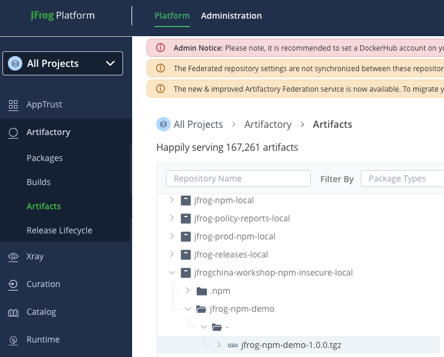
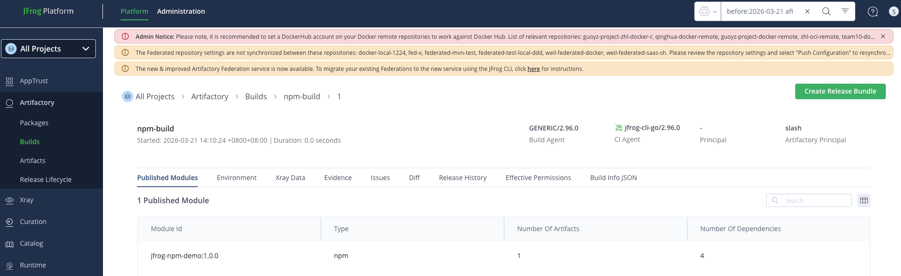

# JFrog npm Supply Chain Security Workshop (Curation Focus)

This workshop demonstrates how to protect the npm software supply chain using:
- JFrog Artifactory
- JFrog Xray
- **JFrog Curation**
- JFrog CLI

The focus of this workshop is **package governance and malicious package prevention using JFrog Curation**.

---

# Workshop Architecture



Artifactory acts as the **central repository** while Curation enforces package governance policies before dependencies reach developers.

---

# Prerequisites
Participants only need:
- Docker
- Git
- Access to a JFrog Platform instance with:
  - Artifactory
  - Xray
  - Curation enabled

All other tools run inside the workshop container.

Included tools:

| Tool      | Version |
| --------- | ------- |
| Node.js   | 20      |
| npm       | latest  |
| JFrog CLI | latest  |

Workshop Base docker image
```
docker build -t jfrogchina/workshop:latest .
```

JFrog Artifactory Npm repository
- Remote repo: `jfrogchina-workshop-npm-remote`
- Local repo: `jfrogchina-workshop-npm-insecure-local`
- Virtual repo: `jfrogchina-workshop-npm-virtual`

---

# Start Workshop Container
This workshop uses the prebuilt Docker image `jfrogchina/workshop`.

If you are on Apple Silicon or another ARM64 machine, add `--platform linux/amd64` because the image currently does not provide an ARM64 manifest.

Start the workshop environment:

```bash
docker rm -f jfrogchina-workshop >/dev/null 2>&1 || true

docker run -d \
  --name jfrogchina-workshop \
  jfrogchina/workshop \
  tail -f /dev/null

docker exec -it jfrogchina-workshop bash
```

After the container starts you will be inside the workshop environment.

## Clone Repository

```bash
git clone https://github.com/alexwang66/jfrog-sample.git 
cd /home/workshop/jfrog-sample/npm-sample
```

---

# Verify Environment

```bash
whoami
pwd
node -v
npm -v
jf --version
git --version
```

---

# Configure JFrog CLI

Connect the CLI to Artifactory.

Interactive setup:

```bash
jf c add artifactory-server
```

Non-interactive setup:

```bash
jf c add artifactory-server \
  --url="https://your.artifactory.com" \
  --user="YOUR_USERNAME" \
  --access-token="YOUR_ACCESS_TOKEN" \
  --interactive=false
```

Verify configuration:

```bash
jf c show artifactory-server
jf rt ping --server-id=artifactory-server
```

UI screenshot placeholder:

```text
[Screenshot: JFrog CLI configuration or successful connectivity check]
```

---

# Configure npm Repository

```bash
jf npm-config \
  --server-id-resolve=artifactory-server \
  --server-id-deploy=artifactory-server \
  --repo-resolve=jfrogchina-workshop-npm-virtual \
  --repo-deploy=jfrogchina-workshop-npm-virtual \
  --global=false
```


Dependency flow:

```
Developer
   ↓
npm client
   ↓
Artifactory `jfrogchina-workshop-npm-virtual`
   ↓
npm remote repositories `jfrogchina-workshop-npm-remote`
   ↓
npmjs.org
```

---

# Step 1 – Create a Curation Policy
## Enable curation for npm remote repository
Administration -> Curation Settings -> Remote Repository   
Choose npm, than enabled `jfrogchina-work-npm-remote`


## Create a Curation Policy
Platform -> Curation -> Policies -> `Create Policy`  
- Named as `npm-high-vuln-curation`, next
- Specific remote repositories, choose `jfrogchina-work-npm-remote`, than save

- Choose `CVE with CVSS score of 9 or above (with or without a fix version available)`

- Select `Block` option

- Save this curation policy

---

# Step 2 – Dependency Installation

Install dependencies:

```bash
jf npm install --build-name=npm-build --build-number=1
npm start
```

Dependencies will be downloaded through Artifactory.

Expected runtime output:

```text
Hello from JFrog NPM demo
```

---

# Step 2 – Publish Build Info

Publish the package and build metadata to Artifactory.

```bash
jf npm publish --build-name=npm-build --build-number=1
jf rt bp npm-build 1
```
Verify in the UI:

- `Artifactory -> Artifacts` shows the published npm package


- `Artifactory -> Builds -> npm-build -> 1` shows dependencies and modules



---

# Step 3 – Simulate Malicious Dependency

Edit the demo project:

```
npm-sample/package.json
```

Add the dependency:

```json
"dependencies": {
  "lodash": "^4.17.21",
  "@nx/key": "3.2.0"
}
```

The package **@nx/key@3.2.0** has been flagged in security research as containing malicious behavior.

You can update the file with this script:

```bash
python3 - <<'PY'
import json
from pathlib import Path

package_json = Path("/home/workshop/jfrog-sample/npm-sample/package.json")
data = json.loads(package_json.read_text())
deps = data.setdefault("dependencies", {})
deps["js-yaml"] = "3.14.2"
deps["@nx/key"] = "3.2.0"
package_json.write_text(json.dumps(data, indent=2) + "\n")
print(package_json.read_text())
PY
```

UI screenshot placeholder:

```text
[Screenshot: package.json showing @nx/key version 3.2.0 added to dependencies]
```

---

# Step 4 – Attempt Install Again

Run:

```bash
rm -rf node_modules package-lock.json
jf npm install --build-name=npm-build --build-number=2
```

If Curation policies are configured correctly, installation will be blocked.

Example output:

```
Package blocked by JFrog Curation policy
```

Depending on the policy, you may also see an error indicating the dependency was denied or blocked during resolution from the Artifactory npm virtual repository.

UI screenshot placeholder:

```text
[Screenshot: terminal output showing jf npm install blocked by Curation]
```

---

# Step 5 – Investigate Curation Audit Events

Open the JFrog Platform UI.

Navigate to:

```
Curation → Audit Events
```

Example event:

```
Blocked package: @nx/key@3.2.0
Policy: malicious package protection
Repository: alex-npm
User: workshop
```

This audit event shows:

- blocked dependency
- repository
- policy applied
- requesting user

UI screenshot placeholder:

```text
[Screenshot: Curation Audit Events page showing blocked package @nx/key@3.2.0]
```

---

# Step 6 – Investigate via Xray

Navigate to:

```
Xray → Violations
```

From here you can analyze:

- dependency tree
- vulnerability details
- malicious indicators

UI screenshot placeholder:

```text
[Screenshot: Xray Violations or package analysis page for the blocked dependency]
```

---

# Learning Objectives

After completing this workshop participants will understand:

### DevOps

- npm dependency proxy through Artifactory
- build-info generation

### Supply Chain Security

- blocking malicious packages using Curation
- enforcing dependency policies
- investigating blocked packages using audit events

---

# Troubleshooting

Verify Node.js:

```bash
node -v
```

Verify npm:

```bash
npm -v
```

Verify JFrog CLI:

```bash
jf --version
```

Verify Artifactory connectivity:

```bash
jf rt ping --server-id=artifactory-server
```

List npm repositories again if the configured virtual repo does not exist:

```bash
jf rt curl -s -XGET "/api/repositories" > /tmp/repos.json
python3 - <<'PY'
import json
with open("/tmp/repos.json") as f:
    data = json.load(f)
for repo in data:
    if repo.get("packageType") == "Npm":
        print(repo.get("key"), repo.get("type"), sep="\t")
PY
```

If you see:

```text
The repository 'npm-virtual' does not exist.
```

replace `--repo-resolve` and `--repo-deploy` with repository names that actually exist in your environment.

If you see:

```text
no matching manifest for linux/arm64/v8 in the manifest list entries
```

restart the container with:

```bash
docker run --platform linux/amd64 ...
```

Ensure your environment can access the Artifactory URL.

---

# One-Shot Demo Script

The following script runs the complete happy-path workshop flow from the host machine.

Replace:

- `YOUR_USERNAME`
- `YOUR_ACCESS_TOKEN`
- repository names if your instance uses different npm repos

```bash
docker rm -f alex-workshop >/dev/null 2>&1 || true

docker run -d \
  --platform linux/amd64 \
  --name alex-workshop \
  alexwang666666/workshop \
  tail -f /dev/null

docker exec alex-workshop bash -lc '
set -euo pipefail

export JF_URL="https://your.artifactory.com"
export JF_USER="YOUR_USERNAME"
export JF_ACCESS_TOKEN="YOUR_ACCESS_TOKEN"
export JF_NPM_RESOLVE_REPO="alex-npm"
export JF_NPM_DEPLOY_REPO="alex-npm-insecure-local"

if [ ! -d /home/workshop/jfrog-sample ]; then
  git clone https://github.com/alexwang66/jfrog-sample.git /home/workshop/jfrog-sample
fi

cd /home/workshop/jfrog-sample/npm-sample

jf c rm artifactory-server --quiet >/dev/null 2>&1 || true
jf c add artifactory-server \
  --url="$JF_URL" \
  --user="$JF_USER" \
  --access-token="$JF_ACCESS_TOKEN" \
  --interactive=false

jf rt ping --server-id=artifactory-server

jf npm-config \
  --server-id-resolve=artifactory-server \
  --server-id-deploy=artifactory-server \
  --repo-resolve="$JF_NPM_RESOLVE_REPO" \
  --repo-deploy="$JF_NPM_DEPLOY_REPO" \
  --global=false

jf npm install --build-name=npm-build --build-number=1
npm start
jf npm publish --build-name=npm-build --build-number=1
jf rt bp npm-build 1
'
```

---

# Curation Test Script

The following script modifies the npm sample to include a malicious dependency candidate and then retries installation.

```bash
docker exec alex-workshop bash -lc '
set -euo pipefail

cd /home/workshop/jfrog-sample/npm-sample

python3 - <<'"'"'PY'"'"'
import json
from pathlib import Path

package_json = Path("package.json")
data = json.loads(package_json.read_text())
deps = data.setdefault("dependencies", {})
deps["js-yaml"] = "3.14.2"
deps["@nx/key"] = "3.2.0"
package_json.write_text(json.dumps(data, indent=2) + "\n")
print(package_json.read_text())
PY

rm -rf node_modules package-lock.json
jf npm install --build-name=npm-build --build-number=2
'
```

Expected result:

- dependency resolution fails
- Curation audit events record the blocked package

---

# Clean Up

Remove the workshop container:

```bash
docker rm -f alex-workshop
```

Remove the Docker image if necessary:

```bash
docker rmi alexwang666666/workshop:latest
```

---

# Resources

JFrog Artifactory  
[https://jfrog.com/artifactory/](https://jfrog.com/artifactory/)

JFrog Xray  
[https://jfrog.com/xray/](https://jfrog.com/xray/)

JFrog Curation  
[https://jfrog.com/platform/curation/](https://jfrog.com/platform/curation/)

JFrog CLI  
[https://jfrog.com/getcli/](https://jfrog.com/getcli/)
