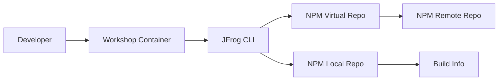

# JFrog NPM Workshop

This workshop uses the prebuilt Docker Hub image `alexwang666666/workshop` to start a ready-to-use environment with:

- Node.js
- npm
- JFrog CLI
- Git

The workflow covered in this document is:

1. Start the workshop container
2. Clone the `jfrog-sample` repository inside the container
3. Configure JFrog CLI
4. Configure npm to resolve and deploy through Artifactory
5. Install dependencies with `jf npm install`
6. Run the npm sample
7. Publish the package and build-info to Artifactory

---

## Prerequisites

You need:

- Docker Desktop or Docker Engine
- Network access to Docker Hub
- Network access to your JFrog Platform instance
- A valid JFrog user and access token

This workshop was validated against:

- JFrog URL: `https://your.artifactory.com`
- Docker image: `alexwang666666/workshop:latest`

---

## Architecture



---

## Step 1: Start the Workshop Container

If you are on Apple Silicon or another ARM64 machine, use `--platform linux/amd64` because this image currently does not provide an ARM64 manifest.

```bash
docker run -d \
  --platform linux/amd64 \
  --name alex-workshop \
  alexwang666666/workshop \
  tail -f /dev/null
```

Check that the container is running:

```bash
docker ps --filter name=alex-workshop
```

Enter the container:

```bash
docker exec -it alex-workshop bash
```

---

## Step 2: Verify the Built-In Tools

Inside the container, verify the environment:

```bash
whoami
pwd
node -v
npm -v
jf --version
git --version
```

Expected result:

- current user is `workshop`
- `node`, `npm`, `jf`, and `git` are available

---

## Step 3: Clone the Workshop Repository

Inside the container:

```bash
git clone https://github.com/alexwang66/jfrog-sample.git /home/workshop/jfrog-sample
cd /home/workshop/jfrog-sample/npm-sample
```

Verify the project:

```bash
ls -la
cat package.json
```

The npm sample uses:

```json
{
  "name": "jfrog-npm-demo",
  "version": "1.0.0",
  "scripts": {
    "start": "node index.js"
  }
}
```

---

## Step 4: Configure JFrog CLI

Configure JFrog CLI with your Artifactory URL, username, and access token.

Interactive form:

```bash
jf c add artifactory-server
```

Non-interactive form:

```bash
jf c add artifactory-server \
  --url="https://your.artifactory.com" \
  --user="YOUR_USERNAME" \
  --access-token="YOUR_ACCESS_TOKEN" \
  --interactive=false
```

Verify connectivity:

```bash
jf rt ping --server-id=artifactory-server
```

Expected output:

```text
OK
```

You can also review the configured server:

```bash
jf c show artifactory-server
```

---

## Step 5: Find Available NPM Repositories

If you are not sure which npm repositories exist in your JFrog instance, list them:

```bash
jf rt curl -s -XGET "/api/repositories" > /tmp/repos.json
python3 - <<'PY'
import json
with open("/tmp/repos.json") as f:
    data = json.load(f)
for repo in data:
    if repo.get("packageType") == "Npm":
        print(repo.get("key"), repo.get("type"), sep="\t")
PY
```

In the validated environment, these repositories were used:

- Resolve repo: `alex-npm`
- Deploy repo: `alex-npm-insecure-local`

If your environment uses different repository names, replace them in the next steps.

---

## Step 6: Configure npm with JFrog CLI

Inside `npm-sample`, configure npm resolution and deployment:

```bash
cd /home/workshop/jfrog-sample/npm-sample

jf npm-config \
  --server-id-resolve=artifactory-server \
  --server-id-deploy=artifactory-server \
  --repo-resolve=alex-npm \
  --repo-deploy=alex-npm-insecure-local \
  --global=false
```

This creates the local JFrog project config under:

```bash
.jfrog/projects/npm.yaml
```

---

## Step 7: Install Dependencies Through Artifactory

Run the install through JFrog CLI:

```bash
jf npm install --build-name=npm-build --build-number=1
```

Expected result:

- dependencies are resolved through the Artifactory virtual npm repository
- build metadata is collected for build name `npm-build`
- build number is `1`

Typical output:

```text
up to date, audited 5 packages in a few seconds
found 0 vulnerabilities
```

---

## Step 8: Run the npm Sample

Start the sample application:

```bash
npm start
```

Expected output:

```text
Hello from JFrog NPM demo
```

This confirms the package installation and local runtime are working correctly inside the workshop container.

---

## Step 9: Publish the Package to Artifactory

Publish the npm package:

```bash
jf npm publish --build-name=npm-build --build-number=1
```

Expected result:

- package `jfrog-npm-demo@1.0.0` is published to the deploy repository
- the same build name and build number are associated with the deployment

Typical output includes:

```text
npm publish finished successfully.
```

---

## Step 10: Publish Build Info

Publish build-info to Artifactory:

```bash
jf rt bp npm-build 1
```

Expected result:

- build-info is uploaded successfully
- the build appears in the JFrog UI

In the validated environment, the build info URL looked like this:

```text
https://your.artifactory.com/ui/builds/npm-build/1/.../published?buildRepo=artifactory-build-info
```

Open the JFrog UI and navigate to:

```text
Builds -> npm-build -> 1
```

Review:

- published modules
- dependencies
- environment data
- artifacts

---

## One-Shot Script

The following script runs the complete workshop flow from the host machine.

Before running it, replace:

- `YOUR_USERNAME`
- `YOUR_ACCESS_TOKEN`
- repository names if your instance does not use `alex-npm` and `alex-npm-insecure-local`

```bash
docker rm -f alex-workshop >/dev/null 2>&1 || true

docker run -d \
  --platform linux/amd64 \
  --name alex-workshop \
  alexwang666666/workshop \
  tail -f /dev/null

docker exec alex-workshop bash -lc '
set -euo pipefail

export JF_URL="https://your.artifactory.com"
export JF_USER="YOUR_USERNAME"
export JF_ACCESS_TOKEN="YOUR_ACCESS_TOKEN"
export JF_NPM_RESOLVE_REPO="alex-npm"
export JF_NPM_DEPLOY_REPO="alex-npm-insecure-local"

if [ ! -d /home/workshop/jfrog-sample ]; then
  git clone https://github.com/alexwang66/jfrog-sample.git /home/workshop/jfrog-sample
fi

cd /home/workshop/jfrog-sample/npm-sample

jf c rm artifactory-server --quiet >/dev/null 2>&1 || true
jf c add artifactory-server \
  --url="$JF_URL" \
  --user="$JF_USER" \
  --access-token="$JF_ACCESS_TOKEN" \
  --interactive=false

jf rt ping --server-id=artifactory-server

jf npm-config \
  --server-id-resolve=artifactory-server \
  --server-id-deploy=artifactory-server \
  --repo-resolve="$JF_NPM_RESOLVE_REPO" \
  --repo-deploy="$JF_NPM_DEPLOY_REPO" \
  --global=false

jf npm install --build-name=npm-build --build-number=1
npm start
jf npm publish --build-name=npm-build --build-number=1
jf rt bp npm-build 1
'
```

---

## Troubleshooting

### 1. Image cannot start on Apple Silicon

Error:

```text
no matching manifest for linux/arm64/v8 in the manifest list entries
```

Fix:

```bash
docker run --platform linux/amd64 ...
```

### 2. Repository does not exist

Error:

```text
The repository 'npm-virtual' does not exist.
```

Cause:

- the repository name in your JFrog instance is different from the example

Fix:

- list repositories with `jf rt curl`
- replace `--repo-resolve` and `--repo-deploy` with the correct names

### 3. Permission denied while cloning into `/root`

Cause:

- the container user is `workshop`, not `root`

Fix:

Use:

```bash
git clone https://github.com/alexwang66/jfrog-sample.git /home/workshop/jfrog-sample
```

### 4. JFrog CLI ping fails

Check:

- JFrog URL is correct
- username is correct
- access token is valid
- your network can reach the JFrog instance

Retry:

```bash
jf rt ping --server-id=artifactory-server
```

---

## Cleanup

Stop and remove the container when finished:

```bash
docker rm -f alex-workshop
```

Optionally remove the image:

```bash
docker rmi alexwang666666/workshop:latest
```

---

## Summary

This workshop demonstrates a complete npm flow using a prebuilt container:

1. Start a workshop container from Docker Hub
2. Clone the sample repository
3. Configure JFrog CLI
4. Configure npm resolution and deployment through Artifactory
5. Install dependencies with build-info collection
6. Run the npm sample
7. Publish the npm package
8. Publish build-info to the JFrog Platform

Validated results from this run:

- container name: `alex-workshop`
- image: `alexwang666666/workshop:latest`
- sample path: `/home/workshop/jfrog-sample/npm-sample`
- runtime output: `Hello from JFrog NPM demo`
- build name: `npm-build`
- build number: `1`
