# JFrog Xray Workshop

This workshop demonstrates a basic end-to-end Xray flow by using the existing `npm-sample` project in this repository.

The workflow covered in this document is:

1. Start the workshop container
2. Clone the `jfrog-sample` repository inside the container
3. Configure JFrog CLI
4. Configure npm to resolve and deploy through Artifactory
5. Enable Xray indexing for the target repositories and builds
6. Build and publish npm package build-info
7. Trigger or review the Xray scan results
8. Fix the vulnerable dependency and verify the new build

---

## Prerequisites

You need:

- Docker Desktop or Docker Engine
- Network access to Docker Hub
- Network access to your JFrog Platform instance
- A valid JFrog user and access token
- JFrog Xray enabled in your Platform instance

This workshop was validated against:

- Sample project: `npm-sample`
- Vulnerable package used for the demo: `js-yaml:3.14.1`

---

## Architecture

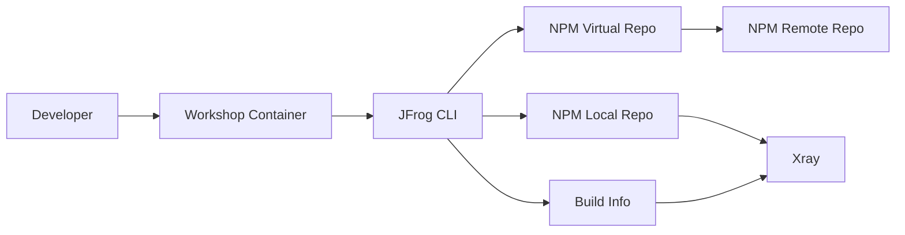

---
## Prerequisite
### Workshop Base docker image
Build the Docker image required for the workshop
```
docker build -t jfrogchina/workshop:latest .
```

### JFrog Artifactory Npm repository
- Remote repo: `jfrogchina-workshop-npm-remote`
- Local repo: `jfrogchina-workshop-npm-insecure-local`
- Virtual repo: `jfrogchina-workshop-npm-virtual`

---

## Step 1: Start the Workshop Container

If you are on Apple Silicon or another ARM64 machine, use `--platform linux/amd64` because this image currently does not provide an ARM64 manifest.

```bash
docker rm -f jfrogchina-workshop >/dev/null 2>&1 || true

docker run -d \
  --name jfrogchina-workshop \
  jfrogchina/workshop \
  tail -f /dev/null
```

Check that the container is running:

```bash
docker ps --filter name=jfrogchina-workshop
```

Enter the container:

```bash
docker exec -it jfrogchina-workshop bash
```

---

## Step 2: Verify the Built-In Tools

Inside the container, verify the environment:

```bash
whoami
pwd
node -v
npm -v
jf --version
git --version
```

Expected result:

- current user is `workshop`
- `node`, `npm`, `jf`, and `git` are available

---

## Step 3: Clone the Workshop Repository

Inside the container:

```bash
git clone https://github.com/alexwang66/jfrog-sample.git 

cd /home/workshop/jfrog-sample/npm-sample
```

Verify the project:

```bash
ls -la
cat package.json
```

The sample currently contains this vulnerable dependency:

```json
"dependencies": {
  "js-yaml": "3.14.1",
  "lodash": "4.17.10"
}
```

---

## Step 4: Configure JFrog CLI

Configure JFrog CLI with your Artifactory URL, username, and access token.

Generate your own access token:  
Edit Profile -> input password -> click [Generate an Identity Token]
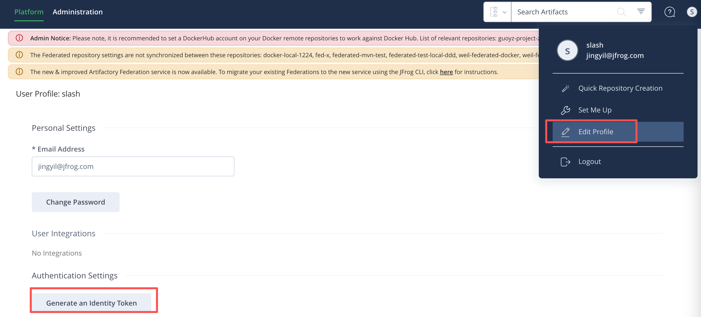
Then copy it for the next step.  
Warning: Once the dialog box is closed, it will be impossible to copy the token again. You will need to generate a new one.

Interactive form:

```bash
jf c add artifactory-server
```

Non-interactive form:

```bash
jf c add artifactory-server \
  --url="https://your.artifactory.com" \
  --user="YOUR_USERNAME" \
  --access-token="YOUR_ACCESS_TOKEN" \
  --interactive=false
```

Verify connectivity:

```bash
jf rt ping --server-id=artifactory-server
```

Expected output:

```text
OK
```

---

## Step 5: Configure npm with JFrog CLI

Inside `npm-sample`, configure npm resolution and deployment:

```bash
cd /home/workshop/jfrog-sample/npm-sample

jf npm-config \
  --server-id-resolve=artifactory-server \
  --server-id-deploy=artifactory-server \
  --repo-resolve=jfrogchina-workshop-npm-virtual \
  --repo-deploy=jfrogchina-workshop-npm-virtual \
  --global=false
```

This creates the local project configuration under:

```bash
.jfrog/projects/npm.yaml
```

---

## Step 6: Enable Xray Indexing

Before reviewing findings, make sure Xray indexes the repositories and builds used by this workshop.

In the JFrog UI:

1. Go to `Administration -> Xray Settings -> Indexed Resources`
2. Add your npm local repository, for example `jfrogchina-workshop-npm-insecure-local`
3. If you want dependency cache visibility, also add the related virtual or remote repository as needed
4. Open the build indexing section and add a build pattern:

```text
**/*
```

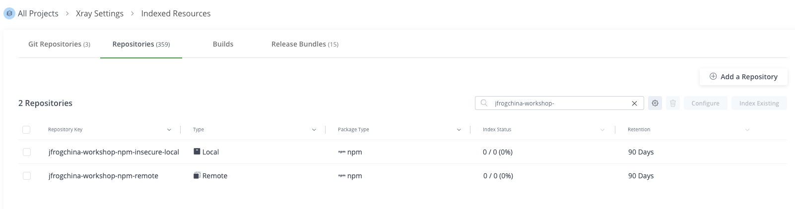

Recommended scope for this workshop:

- Indexed repository: the npm local repository used for publish
- Indexed build pattern: `**/*`

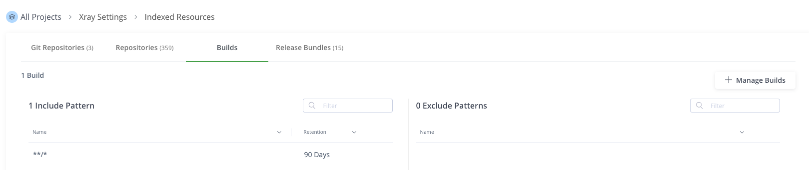

---

## Step 7: Install Dependencies and Collect Build Info

Install dependencies through Artifactory and attach build metadata:

```bash
jf npm install --build-name=npm-build --build-number=1
```

Run the sample:

```bash
npm start
```

Expected output:

```text
Hello from JFrog NPM demo
```

---

## Step 8: Publish Package and Build Info

Publish the package and build metadata to Artifactory:

```bash
jf npm publish --build-name=npm-build --build-number=1
jf rt bp npm-build 1
```

Verify in the UI:

- `Artifactory -> Artifacts` shows the published npm package


- `Artifactory -> Builds -> npm-build -> 1` shows dependencies and modules


---

## Step 9: Review Xray Findings

Once the build and repository are indexed, review the findings in one of these ways.

### Option A: Review in the JFrog UI

Open:

- `Platform` -> `Xray -> Scans List` -> `Builds` -> `npm-build`

Look for findings related to:  
- Security Overview
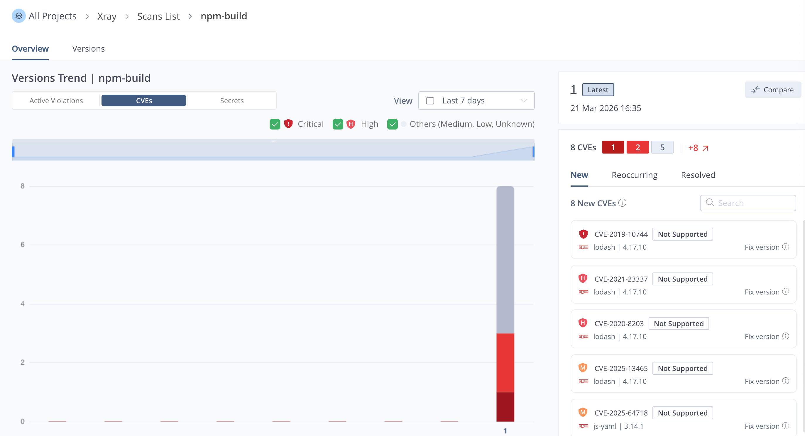

- Security vulnerabilities  
Click Versions, you can see SBOM and all vulnerabilities.
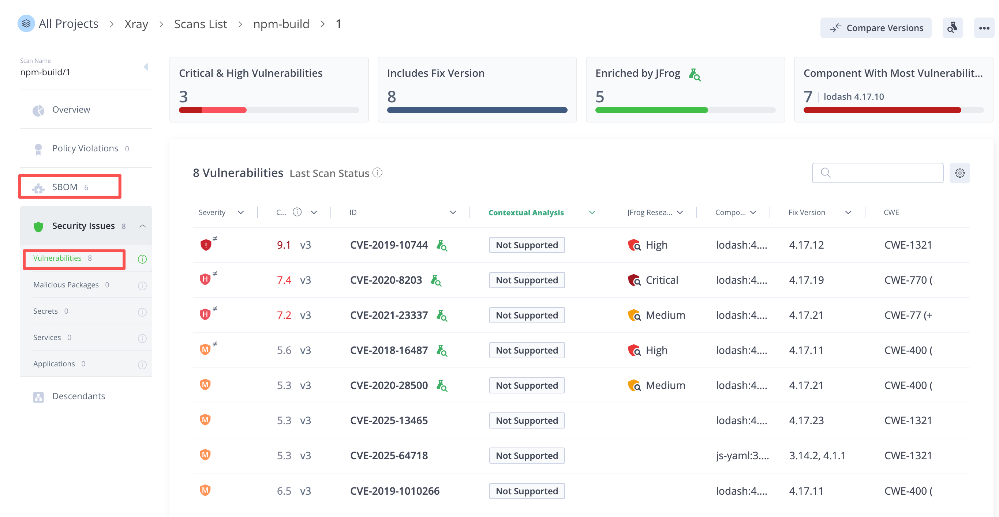

### Option B: Trigger a Build Scan from CLI

```bash
jf bs npm-build 1 --rescan=true
```

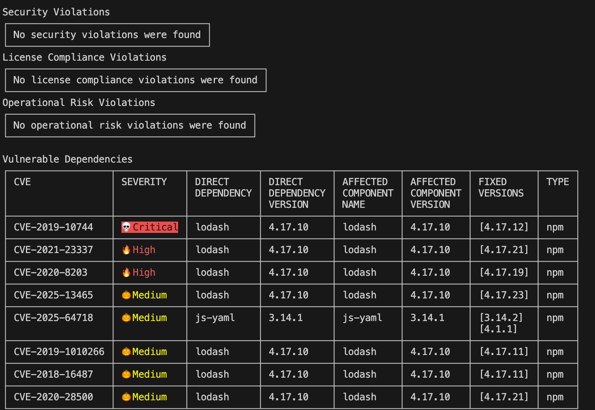

If your environment has policies and watches configured, this command will return the detected violations for the build.

---

## Step 10: Configure Security Policy and Watch

If your Xray instance does not yet have policy enforcement for this workshop, create a simple rule set in the UI:

1. Go to `Xray -> Watches & Policies`
2. Create a security policy named as `npm-security-policy`
3. Add a rule named as `npm-high-vuln-rule`:
   - Severity: `High` and above
   - Action: Block Download
   - Save Policy
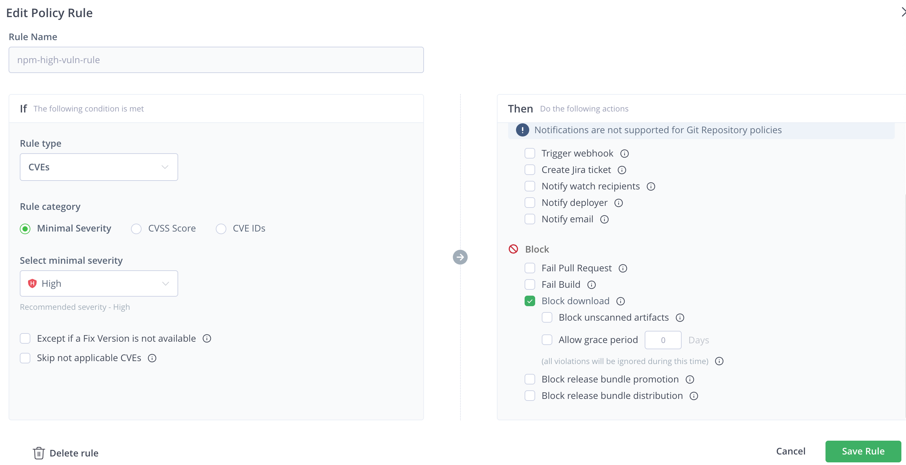

4. Go to `Xray -> Watches & Policies -> Watches`
5. Create a watch such as `npm-build-watch`
6. Add Repository & Add Build
   - repository `jfrogchina-workshop-npm-insecure-local`
   - build `npm-build`
7. Manage Policies, select policy `npm-security-policy`
   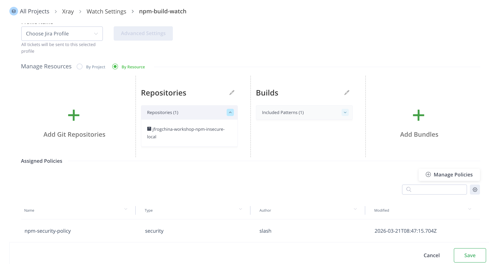

In this way, we have configured to only focus on vulnerabilities of the high-risk level and above.

Once again, go to the scan result page of npm-build.
Click `Policy Violations`, only show the vulnerabilities of the high-risk level and above.
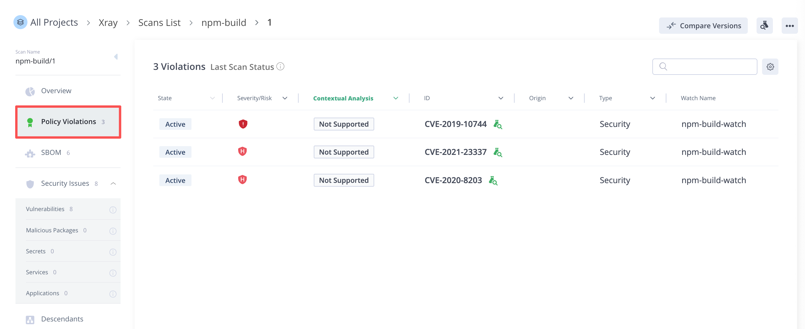

---

## Step 11: Remediate the Vulnerability

Edit the dependency in `package.json`:

```bash
sed -i 's/"lodash": "4.17.10"/"lodash": "4.17.21"/' package.json
```

Then rebuild and publish a new build number:

```bash
rm -rf node_modules package-lock.json

jf npm install --build-name=npm-build --build-number=2
jf npm publish --build-name=npm-build --build-number=2
jf rt bp npm-build 2
jf bs npm-build 2 --rescan=true
```

Expected outcome:
- the new build contains the upgraded dependency
- Xray findings are reduced or cleared, depending on your policy set and Xray data version
- `Policy Violations` shows nothing, because we no longer have any vulnerabilities at the high-risk level or above.
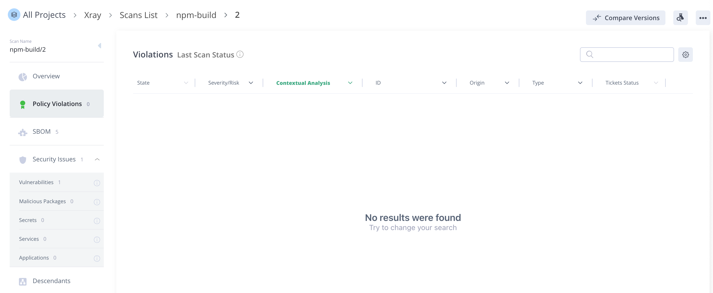

---

## Validation Checklist
At the end of the workshop you should be able to confirm:
- npm dependencies were resolved through Artifactory
- build info was published to Artifactory
- Xray indexed the repository or build
- Xray displayed findings for the vulnerable package version
- after upgrading the dependency, the new build showed fewer or no violations

---

## Troubleshooting

### `jf rt ping` fails

Check:

- JFrog Platform URL
- username or token
- network connectivity from the container

### `jf npm install` does not go through Artifactory

Check:

- `.jfrog/projects/npm.yaml` exists
- `repo-resolve` points to your npm virtual repository
- the configured server ID is correct

### No Xray results appear

Check:

- Xray is licensed and enabled
- the repository is indexed
- build indexing pattern includes your build
- a policy and watch are attached if you expect violations instead of raw findings

---

## Suggested Next Steps

- Add license policy checks in the same watch
- Repeat the workshop with a Maven or Docker sample
- Integrate `jf bs` into CI/CD and fail the pipeline on policy violations
